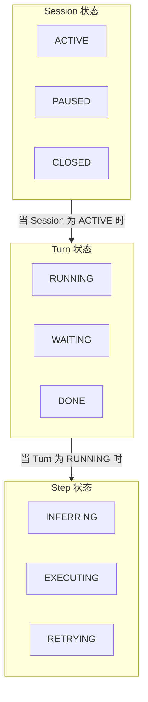
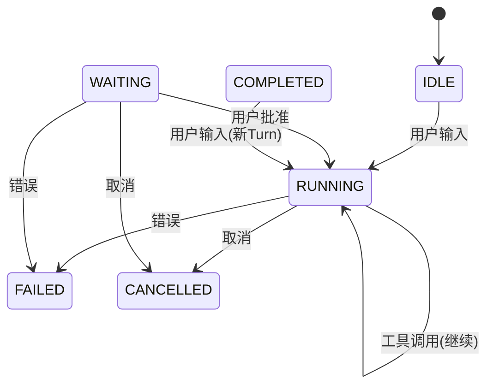

# 06. 状态机与持久化

## 一、为什么 Agent 需要显式状态机

Chatbot 通常是无状态的：接收请求 → 调用模型 → 返回结果 → 忘记一切。

Agent 完全不同。一个 Turn 可能涉及：
- 多次 LLM 调用（推理 → 工具 → 再推理）
- 等待用户批准（可能持续数分钟）
- 执行长时间运行的命令
- 处理流式输出中的中断

如果没有显式状态机，Runtime 将无法回答以下问题：
- "当前正在做什么？"
- "可以安全地关闭吗？"
- "上次执行到哪里了？"
- "为什么卡住了？"

## 二、状态机的层次结构

Agent Runtime 的状态是**分层**的：



### 2.1 Session 级状态

```
enum SessionStatus:
    ACTIVE      // 正常会话中
    PAUSED      // 被挂起（等待用户输入或系统资源）
    CLOSED      // 已关闭
    ERROR       // 发生不可恢复错误

Session {
    id: String
    status: SessionStatus
    currentTurn: Turn
    turnHistory: List<Turn>
    createdAt: Timestamp
    lastActivityAt: Timestamp
}
```

### 2.2 Turn 级状态

```
enum TurnStatus:
    IDLE        // 等待开始
    RUNNING     // 正在执行
    WAITING     // 等待用户输入/批准
    COMPLETED   // 正常完成
    CANCELLED   // 用户取消
    FAILED      // 执行失败

Turn {
    id: String
    sessionId: String
    status: TurnStatus
    startedAt: Timestamp
    completedAt: Timestamp
    steps: List<Step>
    cancellationReason: String
}
```

### 2.3 Step 级状态

```
enum StepStatus:
    PREPARING       // 组装上下文
    INFERRING       // LLM 推理中
    EXECUTING_TOOLS // 执行工具中
    COMPLETED       // 完成
    FAILED          // 失败
    RETRYING        // 正在重试

Step {
    id: String
    turnId: String
    status: StepStatus
    type: "inference" | "tool_execution" | "compaction"
    llmRequest: LlmRequest
    llmResponse: LlmResponse
    toolCalls: List<ToolCall>
    toolResults: List<ToolResult>
}
```

## 三、状态转换规则

状态转换不是任意的，必须遵循明确的规则。

### 3.1 状态转换矩阵



### 3.2 状态转换的实现

```
function transitionTurn(turn: Turn, event: TurnEvent):
    validTransitions = getValidTransitions(turn.status)

    if event.targetStatus not in validTransitions:
        throw InvalidStateTransitionError(turn.status, event.targetStatus)

    oldStatus = turn.status
    turn.status = event.targetStatus

    // 记录状态历史
    turn.statusHistory.append({
        from: oldStatus,
        to: event.targetStatus,
        timestamp: now(),
        triggeredBy: event.source,
        reason: event.reason
    })

    // 持久化
    persistTurn(turn)

    // 广播事件
    emitEvent("turn_status_changed", {
        turnId: turn.id,
        from: oldStatus,
        to: event.targetStatus,
        reason: event.reason
    })
```

## 四、Checkpoint 与持久化

Agent Runtime 必须支持**随时恢复**。这意味着关键状态必须持久化到磁盘。

### 4.1 持久化的内容

```
struct Checkpoint:
    session: Session
    currentTurn: Turn
    messageHistory: List<Message>
    toolRegistrySnapshot: List<ToolDefinition>
    pendingApprovals: List<ApprovalRequest>
    userPreferences: UserPreferences

    // 元数据
    version: String           // Checkpoint 格式版本
    createdAt: Timestamp
    compressionMethod: String // 如果进行了压缩
```

### 4.2 持久化策略

| 策略 | 触发时机 | 粒度 | 开销 |
|------|----------|------|------|
| **Eager** | 每次状态转换 | 全量 | 高，但最安全 |
| **Lazy** | 定时（如每 5 秒） | 增量 | 中，可能丢失最近几秒 |
| **On-Demand** | 用户请求、系统信号 | 全量 | 低，按需 |
| **Event-Sourced** | 每个事件 | 事件日志 | 中，可重放 |

**推荐组合策略**：

```
function persistSession(session: Session):
    // 每次关键状态转换都写入（Eager）
    if session.currentTurn?.status in ["WAITING", "COMPLETED", "CANCELLED", "FAILED"]:
        writeCheckpoint(createFullCheckpoint(session))

    // 每 5 秒写入增量（Lazy）
    if now() - session.lastPersistTime > 5000:
        writeDelta(session.unpersistedChanges)
        session.unpersistedChanges.clear()

function onShutdownSignal():
    // 收到关闭信号时立即全量持久化
    for session in activeSessions:
        writeCheckpoint(createFullCheckpoint(session))
```

### 4.3 恢复流程

```
function resumeSession(sessionId: String): Session:
    checkpoint = readLatestCheckpoint(sessionId)

    if checkpoint == null:
        throw SessionNotFoundError(sessionId)

    session = Session {
        id: checkpoint.session.id,
        status: checkpoint.session.status,
        messageHistory: checkpoint.messageHistory,
        ...
    }

    // 恢复待处理的批准请求
    for approval in checkpoint.pendingApprovals:
        session.approvalQueue.enqueue(approval)

    // 如果之前 Turn 在等待用户输入，恢复到 WAITING 状态
    if checkpoint.currentTurn?.status == "WAITING":
        session.currentTurn = checkpoint.currentTurn
        session.status = "ACTIVE"
        emitEvent("session_resumed", { sessionId, atTurn: checkpoint.currentTurn.id })

    return session
```

## 五、会话存储的设计

### 5.1 存储 Schema

```
Table: sessions
    id: String (PK)
    status: String
    agent_id: String
    created_at: Timestamp
    updated_at: Timestamp
    metadata: JSON

Table: turns
    id: String (PK)
    session_id: String (FK)
    status: String
    started_at: Timestamp
    completed_at: Timestamp
    token_usage: JSON
    error_info: JSON

Table: messages
    id: String (PK)
    session_id: String (FK)
    turn_id: String (FK)
    role: String
    visibility: String
    created_at: Timestamp

Table: message_parts
    id: String (PK)
    message_id: String (FK)
    type: String
    content: Text
    tool_call_id: String
    tool_name: String
    arguments: JSON
    is_error: Boolean

Table: checkpoints
    id: String (PK)
    session_id: String (FK)
    turn_id: String
    data: BLOB          // 序列化的 Checkpoint
    created_at: Timestamp
```

### 5.2 增量更新优化

如果每次状态变化都写全量数据，I/O 开销很大。应该支持字段级增量更新：

```
function updatePartDelta(partId: String, field: String, delta: String):
    // 只更新一个字段，使用追加语义
    executeSQL(
        "UPDATE message_parts SET content = content || ? WHERE id = ?",
        [delta, partId]
    )

function updateTurnStatus(turnId: String, newStatus: String):
    executeSQL(
        "UPDATE turns SET status = ?, updated_at = ? WHERE id = ?",
        [newStatus, now(), turnId]
    )
```

## 六、多会话管理

Runtime 通常需要同时管理多个会话：

```
class SessionManager:
    activeSessions: Map<String, Session>
    persistence: PersistenceLayer

    function createSession(agentId: String): Session:
        session = Session {
            id: generateUUID(),
            agentId: agentId,
            status: "ACTIVE",
            createdAt: now()
        }
        activeSessions[session.id] = session
        persistSession(session)
        return session

    function getSession(sessionId: String): Session:
        if sessionId in activeSessions:
            return activeSessions[sessionId]
        return resumeSession(sessionId)

    function closeSession(sessionId: String):
        session = activeSessions[sessionId]
        session.status = "CLOSED"
        writeCheckpoint(createFullCheckpoint(session))
        activeSessions.remove(sessionId)

    function listActiveSessions(): List<Session>:
        return activeSessions.values()
```

## 七、最佳实践

1. **所有状态转换都必须是可观测的**：每次转换都要记录时间戳、触发源、原因
2. **持久化必须是事务性的**：Checkpoint 写入要么完全成功，要么完全失败，不能留下半完成的状态
3. **保留状态历史，不只是当前状态**：状态转换历史对于调试和审计至关重要
4. **支持从任意 Checkpoint 恢复**：不只是最新的，用户可能想回到之前的某个状态
5. **区分 "内存状态" 和 "持久化状态"**：内存中可以有更丰富的运行时信息，但持久化只保存恢复所需的最小集合
6. **定期清理旧 Checkpoint**：防止存储无限增长，但要保留足够的恢复点
7. **会话隔离**：不同会话的状态绝不能互相污染，即使是同一个 Agent 的多个会话
