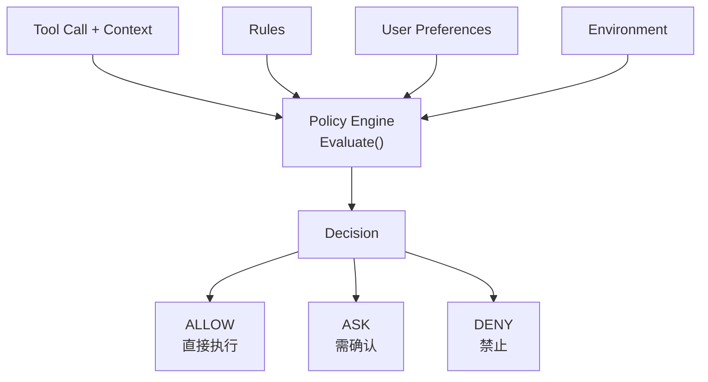
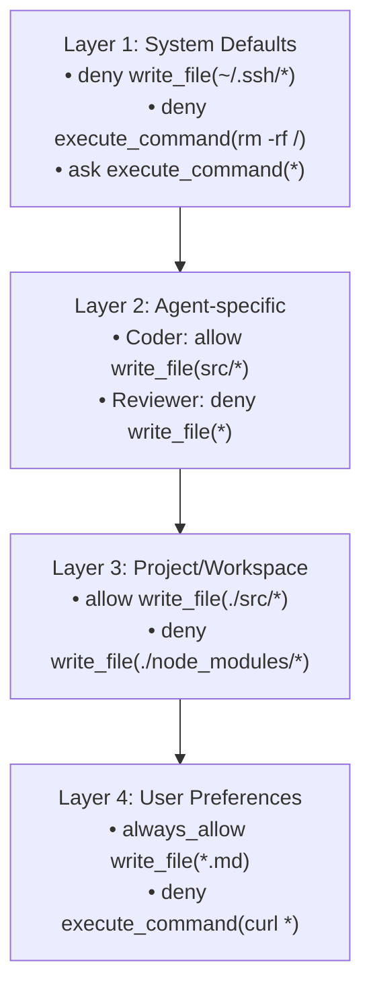

# 07. 权限与策略引擎

## 一、Agent 为什么需要权限系统

Agent 的能力远超传统 Chatbot：它可以读写文件、执行命令、访问网络。如果没有权限控制：

- 一个错误的 Prompt 可能导致 Agent 删除重要文件
- 恶意用户输入可能诱导 Agent 泄露敏感信息
- Agent 可能陷入循环，不断执行昂贵的操作
- 不同场景需要不同的安全级别（个人开发 vs 企业生产）

**权限系统是 Agent Runtime 的安全基石**。

## 二、权限模型的核心概念

### 2.1 三元决策模型



每个工具调用的权限决策有三种可能：

| 决策 | 含义 | 用户交互 |
|------|------|----------|
| **ALLOW** | 允许直接执行 | 无需交互 |
| **ASK** | 需要用户确认 | 弹出确认对话框 |
| **DENY** | 禁止执行 | 立即返回错误 |

### 2.2 规则（Rule）的定义

```
struct PermissionRule:
    permission: "allow" | "ask" | "deny"
    pattern: String           // 匹配模式，支持 wildcard
    action: String            // 具体动作（可选）
    condition: Condition      // 附加条件（可选）
    priority: Integer         // 规则优先级

// 示例规则
rules = [
    PermissionRule {
        permission: "deny",
        pattern: "write_file(~/.ssh/*)",
        description: "Never write to SSH keys directory"
    },
    PermissionRule {
        permission: "ask",
        pattern: "execute_command(rm *)",
        description: "Confirm before any delete command"
    },
    PermissionRule {
        permission: "allow",
        pattern: "read_file(*)",
        description: "Allow reading any file"
    },
    PermissionRule {
        permission: "ask",
        pattern: "write_file(*)",
        condition: { fileSize: "> 1MB" },
        description: "Ask before writing large files"
    }
]
```

### 2.3 规则匹配算法

```
function evaluatePermission(toolCall: ToolCall, context: ExecutionContext): Decision:
    matchedRules = []

    for rule in rules:
        if matches(rule.pattern, toolCall):
            matchedRules.append(rule)

    if matchedRules.isEmpty():
        return Decision.ASK  // 默认策略：未知操作需要确认

    // 按优先级排序，取最高优先级的规则
    matchedRules.sortByDescending(rule -> rule.priority)
    highestPriority = matchedRules[0].priority

    // 同优先级规则中，deny > ask > allow
    samePriorityRules = matchedRules.filter(r -> r.priority == highestPriority)

    if samePriorityRules.any(r -> r.permission == "deny"):
        return Decision.DENY
    else if samePriorityRules.any(r -> r.permission == "ask"):
        return Decision.ASK
    else:
        return Decision.ALLOW
```

## 三、策略层级

权限规则可以来自多个来源，需要按优先级合并。

### 3.1 四层策略架构



### 3.2 层级合并算法

```
function mergePolicies(layers: List<PolicyLayer>): List<PermissionRule>:
    // 从底层到顶层，后面的覆盖前面的
    merged = []

    for layer in layers:
        for rule in layer.rules:
            // 检查是否有冲突规则
            conflicting = merged.find(r -> r.pattern == rule.pattern)
            if conflicting != null:
                if layer.priority > conflicting.sourceLayer.priority:
                    merged.remove(conflicting)
                    merged.append(rule)
            else:
                merged.append(rule)

    return merged
```

## 四、交互式授权

当策略决策为 **ASK** 时，Runtime 必须向用户请求确认。

### 4.1 授权请求的结构

```
struct ApprovalRequest:
    id: String
    timestamp: Timestamp
    toolCall: ToolCall
    humanReadableDescription: String
    riskLevel: "low" | "medium" | "high" | "critical"
    suggestedAlternatives: List<String>

    // 用户的响应
    status: "pending" | "approved" | "rejected" | "timed_out"
    userDecision: "once" | "always" | "reject"
    respondedAt: Timestamp
```

### 4.2 授权流程

```
function requestApproval(toolCall: ToolCall): ApprovalResponse:
    request = createApprovalRequest(toolCall)

    // 发送给用户界面
    emitEvent("permission_request", request)

    // 等待用户响应（可能持续数分钟）
    response = await waitForUserResponse(request.id, timeout: 300000)

    if response.timedOut:
        return ApprovalResponse {
            approved: false,
            reason: "User did not respond within 5 minutes"
        }

    if response.decision == "always":
        // 记住用户的永久偏好
        userPreferences.addRule(PermissionRule {
            permission: "allow",
            pattern: generatePattern(toolCall),
            source: "user_explicit"
        })

    return ApprovalResponse {
        approved: response.decision in ["once", "always"],
        reason: response.reason
    }
```

### 4.3 授权的用户体验设计

好的授权体验应该：

1. **清晰描述即将发生什么**：
   > "The Agent wants to execute: `rm -rf node_modules`
   > This will delete all installed packages. You can reinstall them with `npm install`.
   > [Allow Once] [Always Allow] [Deny]"

2. **显示风险等级**：用颜色或图标标示操作的敏感度

3. **提供替代方案**：如果用户拒绝，提供达成相同目标的安全方式

4. **支持批量授权**：对于一系列相似操作，提供"允许剩余全部"选项

## 五、自动化安全审查

除了基于规则的权限控制，高级 Runtime 还可以集成**自动化安全审查**。

### 5.1 审查触发条件

```
function shouldAutoReview(toolCall: ToolCall): Boolean:
    // 触发自动审查的条件
    if toolCall.name == "execute_command":
        return true

    if toolCall.arguments.path matches "*password*" or "*secret*" or "*.env*":
        return true

    if toolCall.arguments.command contains "curl" or "wget":
        return true

    if isHighRiskOperation(toolCall):
        return true

    return false
```

### 5.2 审查内容

```
function performAutoReview(toolCall: ToolCall): ReviewResult:
    checks = []

    // 检查 1：命令注入
    if toolCall.name == "execute_command":
        if containsCommandInjection(toolCall.arguments.command):
            checks.append({passed: false, reason: "Potential command injection detected"})

    // 检查 2：路径遍历
    if toolCall.arguments.path:
        if containsPathTraversal(toolCall.arguments.path):
            checks.append({passed: false, reason: "Path traversal attempt detected"})

    // 检查 3：敏感数据外泄
    if toolCall.name == "network_request":
        if mayLeakSensitiveData(toolCall.arguments):
            checks.append({passed: false, reason: "Request may contain sensitive data"})

    // 检查 4：资源滥用
    if mayCauseResourceExhaustion(toolCall):
        checks.append({passed: false, reason: "Operation may exhaust system resources"})

    allPassed = checks.all(c -> c.passed)
    return ReviewResult {
        passed: allPassed,
        checks: checks
    }
```

## 六、审计与追踪

所有权限决策都必须被记录，用于事后审计。

```
struct AuditLogEntry:
    id: String
    timestamp: Timestamp
    sessionId: String
    turnId: String
    toolCall: ToolCall
    decision: "allow" | "ask" | "deny"
    matchedRules: List<String>     // 匹配到的规则 ID
    userResponse: String           // 如果是 ASK，记录用户的响应
    autoReviewResult: ReviewResult // 自动审查结果
    executorInfo: ExecutorInfo     // 执行环境信息

function logPermissionDecision(entry: AuditLogEntry):
    auditLog.write(entry)
    emitEvent("audit_log_entry", entry)
```

## 七、最佳实践

1. **默认拒绝原则**：如果没有明确允许的规则，默认应该 ASK 或 DENY
2. **最小权限原则**：每个 Agent 只拥有完成其任务所需的最小权限集
3. **规则要可审计**：每条规则必须有来源（系统默认、Agent 配置、用户设置）和描述
4. **支持规则测试**：提供工具验证规则是否按预期工作，而不会意外放行危险操作
5. **权限决策要快**：规则匹配应该是 O(1) 或 O(log n)，不能成为性能瓶颈
6. **区分 "阻止" 和 "询问"**：DENY 是系统强制阻止，ASK 是交给用户判断
7. **定期审查规则**：随着 Agent 能力提升，旧的规则可能不再适用
