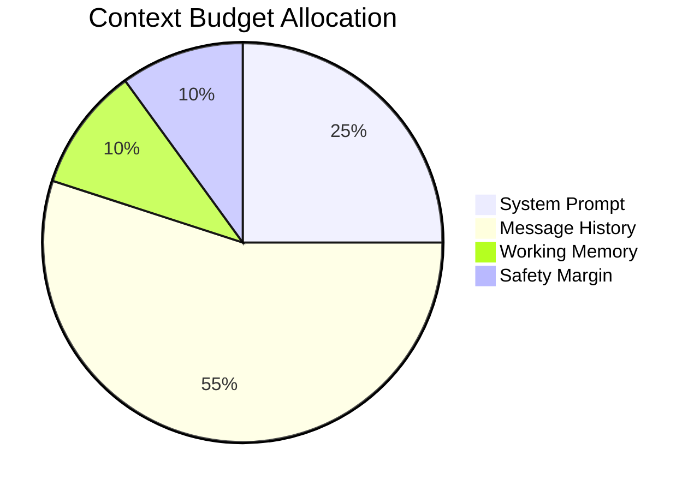
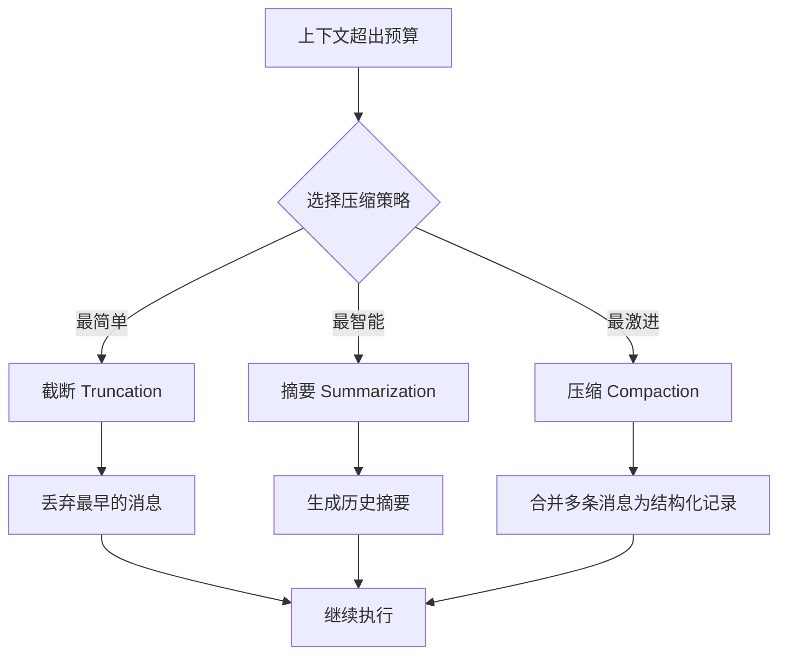

# 08. 上下文管理

## 一、为什么上下文管理是 Agent 的核心挑战

LLM 的上下文窗口是有限的。当 Agent 执行多轮工具调用、处理长文档或维护长期会话时，上下文必然溢出。

没有上下文管理，Agent 会：
- **遗忘早期信息**：用户最初的指令在几轮后被截断
- **重复执行**：因为看不到之前的工具结果而重复调用
- **成本失控**：Token 消耗随历史线性增长
- **性能下降**：模型处理长上下文的延迟和准确率都会变差

**上下文管理的目标**：在有限的 Token 预算内，保留最有价值的信息。

## 二、上下文预算模型

### 2.1 预算分配

一个 Turn 可用的 Token 不是无限的，需要精打细算：



各组成部分：

| 组成部分 | 说明 | 典型占比 |
|----------|------|----------|
| **System Prompt** | 基础身份、技能、规则 | 20-30% |
| **Message History** | 用户和 Agent 的对话记录 | 50-60% |
| **Working Memory** | 工具结果、检索内容、中间状态 | 10-15% |
| **Safety Margin** | 预留空间，防止超出限制 | 10% |

### 2.2 预算的计算

```
function calculateContextBudget(config: ContextConfig): Budget:
    totalLimit = config.modelContextWindow     // 如 128K
    safetyMargin = totalLimit * 0.1            // 10% 安全余量

    effectiveLimit = totalLimit - safetyMargin

    // System Prompt 是固定的（或变化不频繁）
    systemTokens = estimateTokens(config.systemPrompt)

    // 留给历史的动态空间
    historyBudget = effectiveLimit - systemTokens - config.workingMemoryReserve

    return Budget {
        totalLimit: totalLimit,
        effectiveLimit: effectiveLimit,
        systemTokens: systemTokens,
        historyBudget: historyBudget,
        workingMemoryReserve: config.workingMemoryReserve
    }
```

## 三、上下文压缩策略

当历史消息超过预算时，有三种策略可选：



### 3.1 截断（Truncation）

最直接的方式：从最早的消息开始删除，直到满足预算。

```
function truncateHistory(messages: List<Message>, maxTokens: Integer): List<Message>:
    truncated = messages.copy()
    currentTokens = estimateTokenCount(truncated)

    while currentTokens > maxTokens and truncated.length > 1:
        // 移除最早的一条用户/助手消息对
        removed = truncated.removeAt(0)
        currentTokens -= estimateTokenCount([removed])

    // 保留 System Prompt，绝不截断
    return truncated
```

**优点**：简单、快速、确定性强
**缺点**：丢失信息，Agent 可能忘记用户最初的指令

### 3.2 摘要（Summarization）

将早期的对话历史压缩成一段摘要文本，替代原始消息。

```
function summarizeHistory(messages: List<Message>): Summary:
    // 选择需要摘要的消息（如最早的一半）
    toSummarize = messages.slice(0, messages.length / 2)
    recentMessages = messages.slice(messages.length / 2)

    // 使用 LLM 生成摘要
    summaryPrompt = "Summarize the following conversation, preserving key decisions and context:"
    summaryResponse = llm.generate(summaryPrompt + formatMessages(toSummarize))

    summaryMessage = Message {
        role: "system",
        content: "Previous conversation summary: " + summaryResponse.text
    }

    return [summaryMessage] + recentMessages
```

**优点**：保留语义，信息密度高
**缺点**：需要额外的 LLM 调用（耗时且消耗 Token），摘要可能遗漏细节

### 3.3 压缩（Compaction）

将工具调用和结果合并为精简的文本记录，保留关键信息但去除冗余。

```
function compactToolCalls(messages: List<Message>): List<Message>:
    compacted = []
    i = 0

    while i < messages.length:
        message = messages[i]

        if message.role == "assistant" and message.hasToolCalls:
            // 收集这一轮的助手消息 + 所有工具结果
            toolCallMsg = message
            toolResults = []
            i += 1

            while i < messages.length and messages[i].role == "tool":
                toolResults.append(messages[i])
                i += 1

            // 合并为紧凑记录
            compactRecord = formatCompactRecord(toolCallMsg, toolResults)
            compacted.append(Message {
                role: "system",
                content: compactRecord
            })
        else:
            compacted.append(message)
            i += 1

    return compacted

function formatCompactRecord(toolCall: Message, results: List<Message>): String:
    lines = ["Tool execution summary:"]
    for call in toolCall.toolCalls:
        result = results.find(r -> r.toolCallId == call.id)
        lines.append("- " + call.name + "(" + formatArgs(call.arguments) + ") => " +
                     truncate(result.content, 200))
    return lines.join("\n")
```

**优点**：保留结构化信息，比摘要更精确
**缺点**：实现复杂，需要理解消息结构

### 3.4 智能选择策略

```
function compressContext(session: Session): CompressionResult:
    budget = session.contextBudget
    currentTokens = estimateTokenCount(session.messages)

    if currentTokens <= budget.historyBudget:
        return CompressionResult { action: "none", savedTokens: 0 }

    overflow = currentTokens - budget.historyBudget

    // 轻度溢出：先尝试压缩工具调用
    if overflow < budget.historyBudget * 0.2:
        compacted = compactToolCalls(session.messages)
        saved = currentTokens - estimateTokenCount(compacted)
        if saved >= overflow:
            return CompressionResult { action: "compact", messages: compacted, savedTokens: saved }

    // 中度溢出：摘要早期历史
    if overflow < budget.historyBudget * 0.5:
        summarized = summarizeHistory(session.messages)
        saved = currentTokens - estimateTokenCount(summarized)
        return CompressionResult { action: "summarize", messages: summarized, savedTokens: saved }

    // 重度溢出：截断 + 摘要
    truncated = truncateHistory(session.messages, budget.historyBudget * 0.7)
    finalMessages = summarizeHistory(truncated)
    saved = currentTokens - estimateTokenCount(finalMessages)
    return CompressionResult { action: "truncate+summarize", messages: finalMessages, savedTokens: saved }
```

## 四、Token 估算与监控

### 4.1 Token 估算

```
function estimateTokenCount(text: String): Integer:
    // 简单估算：中文 ≈ 1 token/字，英文 ≈ 0.25 token/字
    // 生产环境应使用 tokenizer（如 tiktoken）
    return tokenizer.encode(text).length

function estimateMessageTokens(message: Message): Integer:
    baseTokens = 4  // 消息格式开销
    contentTokens = estimateTokenCount(formatMessageContent(message))
    return baseTokens + contentTokens

function estimateTokenCount(messages: List<Message>): Integer:
    return messages.map(estimateMessageTokens).sum() + 3  // 对话格式开销
```

### 4.2 实时监控

```
class ContextMonitor:
    function checkBudget(session: Session):
        currentTokens = estimateTokenCount(session.messages)
        budget = session.contextBudget
        usageRatio = currentTokens / budget.effectiveLimit

        // 预警级别
        if usageRatio > 0.9:
            emitEvent("context_critical", {
                sessionId: session.id,
                usageRatio: usageRatio,
                currentTokens: currentTokens,
                action: "immediate_compression"
            })
        else if usageRatio > 0.75:
            emitEvent("context_warning", {
                sessionId: session.id,
                usageRatio: usageRatio,
                currentTokens: currentTokens,
                action: "prepare_compression"
            })
```

## 五、特殊场景的上下文处理

### 5.1 长文档处理

当用户上传大文件时，不应直接塞入上下文：

```
function processLongDocument(filePath: String, maxChunkTokens: Integer): List<DocumentChunk>:
    text = readFile(filePath)
    chunks = splitIntoChunks(text, maxChunkTokens)

    // 只加载当前需要的 chunk
    return chunks.map((chunk, index) -> DocumentChunk {
        index: index,
        content: chunk,
        summary: generateSummary(chunk)
    })

function injectRelevantChunks(session: Session, query: String, chunks: List<DocumentChunk>):
    // 检索最相关的 chunk
    relevantChunks = retrieveRelevantChunks(query, chunks, topK: 3)

    for chunk in relevantChunks:
        session.addMessage(Message {
            role: "system",
            content: "Document excerpt (chunk " + chunk.index + "): " + chunk.content,
            metadata: { source: "document", chunkIndex: chunk.index }
        })
```

### 5.2 多会话上下文共享

某些信息（如用户偏好、项目结构）应在多个 Session 间共享：

```
struct SharedContext:
    userPreferences: UserPreferences
    projectMetadata: ProjectMetadata
    learnedFacts: List<String>     // 从对话中提取的事实

function injectSharedContext(session: Session, shared: SharedContext):
    contextLines = ["Shared context:"]
    contextLines.append("- Project: " + shared.projectMetadata.name)
    contextLines.append("- User preferences: " + formatPreferences(shared.userPreferences))

    if shared.learnedFacts.isNotEmpty():
        contextLines.append("- Known facts:")
        for fact in shared.learnedFacts:
            contextLines.append("  * " + fact)

    session.addSystemContext(contextLines.join("\n"))
```

## 六、上下文管理的最佳实践

1. **永远保留 System Prompt**：无论多紧张，都不要截断 System Prompt
2. **优先压缩工具调用**：工具结果通常最冗长，压缩收益最大
3. **摘要比截断更优雅**：摘要保留语义，截断直接丢失信息
4. **监控 Token 使用**：实时跟踪 Token 消耗，提前预警
5. **区分 "热" 和 "冷" 历史**：最近几轮是热历史（保留原样），早期是冷历史（可摘要）
6. **考虑模型差异**：不同模型的上下文窗口和成本不同，策略应可配置
7. **让用户感知压缩**：如果进行了重大压缩，告知用户 "由于对话较长，已压缩早期内容"
8. **测试压缩质量**：确保压缩后的上下文仍能支持 Agent 正确完成任务
