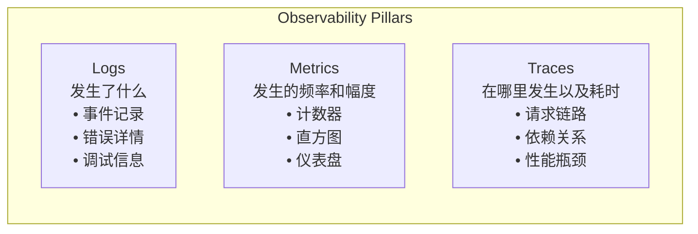
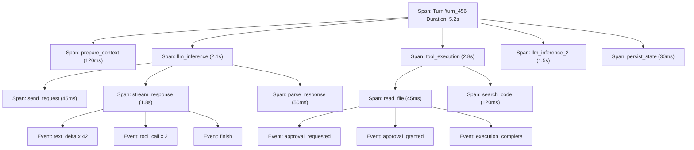

# 09. 可观测性

## 一、为什么 Agent 需要可观测性

Agent Runtime 是生产系统，不是一次性脚本。当它运行时，你需要知道：

- **Agent 在做什么？** 当前执行到哪一步？
- **做得怎么样？** 工具调用成功率、LLM 响应延迟、Token 消耗
- **出了什么问题？** 错误发生在哪里？为什么会失败？
- **性能如何？** 上下文压缩频率、重试次数、用户等待时间

没有可观测性，Agent 就是一个黑盒——用户不知道它在思考还是卡住了，开发者无法诊断问题。

## 二、可观测性的三大支柱



## 三、日志（Logging）

### 3.1 日志级别

```
enum LogLevel:
    DEBUG       // 详细的调试信息（开发时使用）
    INFO        // 常规操作记录
    WARN        // 需要注意但不一定错误
    ERROR       // 错误发生
    FATAL       // 致命错误，系统无法继续
```

### 3.2 Agent 特有的日志事件

```
function logAgentEvent(event: AgentEvent):
    structuredLog = {
        timestamp: now(),
        level: event.level,
        category: event.category,
        sessionId: event.sessionId,
        turnId: event.turnId,
        stepId: event.stepId,
        message: event.message,
        metadata: event.metadata
    }

    // 输出到日志系统
    logger.write(structuredLog)

// 典型日志事件示例
logAgentEvent({
    level: INFO,
    category: "turn_start",
    sessionId: "sess_123",
    turnId: "turn_456",
    message: "Turn started",
    metadata: { inputLength: 42 }
})

logAgentEvent({
    level: INFO,
    category: "llm_request",
    sessionId: "sess_123",
    turnId: "turn_456",
    message: "LLM request sent",
    metadata: {
        modelId: "gpt-4",
        promptTokens: 2048,
        toolCount: 5
    }
})

logAgentEvent({
    level: WARN,
    category: "tool_retry",
    sessionId: "sess_123",
    turnId: "turn_456",
    stepId: "step_789",
    message: "Tool execution failed, retrying",
    metadata: {
        toolName: "read_file",
        attempt: 2,
        error: "Timeout"
    }
})
```

### 3.3 结构化日志

```
// 推荐：结构化 JSON 日志，便于查询和分析
{
    "timestamp": "2024-01-15T10:30:00Z",
    "level": "INFO",
    "logger": "agent.runtime",
    "message": "Tool executed successfully",
    "context": {
        "session_id": "sess_123",
        "turn_id": "turn_456",
        "tool_name": "read_file",
        "duration_ms": 45,
        "result_size": 1024
    }
}
```

## 四、指标（Metrics）

### 4.1 核心指标

| 指标类别 | 具体指标 | 类型 | 说明 |
|----------|----------|------|------|
| **Turn 性能** | turn_duration | Histogram | Turn 总耗时 |
| | turn_success_rate | Gauge | Turn 成功率 |
| **LLM 调用** | llm_latency | Histogram | LLM 请求延迟 |
| | llm_token_usage | Counter | Token 消耗总数 |
| | llm_token_usage_per_model | Counter | 按模型统计 Token |
| | llm_request_rate | Counter | 每秒请求数 |
| | llm_error_rate | Counter | LLM 错误率 |
| **工具执行** | tool_execution_duration | Histogram | 工具执行耗时 |
| | tool_success_rate | Gauge | 工具成功率 |
| | tool_call_frequency | Counter | 各工具调用次数 |
| | approval_required_rate | Gauge | 需要审批的操作比例 |
| **上下文** | context_size | Gauge | 当前上下文大小（Token） |
| | compaction_frequency | Counter | 上下文压缩次数 |
| | compaction_amount | Histogram | 每次压缩的 Token 数 |
| **系统** | active_sessions | Gauge | 活跃会话数 |
| | memory_usage | Gauge | 内存使用 |
| | event_queue_size | Gauge | 事件队列长度 |

### 4.2 指标收集

```
class MetricsCollector:
    metrics: Map<String, Metric>

    function recordTurnDuration(durationMs: Integer, labels: Map<String, String>):
        histogram = metrics.getOrCreate("turn_duration", Histogram)
        histogram.observe(durationMs, labels)

    function recordTokenUsage(tokens: Integer, modelId: String):
        counter = metrics.getOrCreate("llm_token_usage", Counter)
        counter.increment(tokens, { model: modelId })

    function recordToolExecution(toolName: String, durationMs: Integer, success: Boolean):
        durationHistogram = metrics.getOrCreate("tool_execution_duration", Histogram)
        durationHistogram.observe(durationMs, { tool: toolName })

        successCounter = metrics.getOrCreate("tool_success_total", Counter)
        successCounter.increment(1, { tool: toolName, status: success ? "success" : "failure" })
```

### 4.3 指标导出

```
// OpenTelemetry 格式（行业标准）
function exportToOpenTelemetry(metrics: Map<String, Metric>):
    for metric in metrics.values:
        otelMetric = convertToOtelFormat(metric)
        otelExporter.export(otelMetric)

// Prometheus 格式（便于 Grafana 展示）
function exportToPrometheus(): String:
    output = ""
    for metric in metrics.values:
        output += "# HELP " + metric.name + " " + metric.description + "\n"
        output += "# TYPE " + metric.name + " " + metric.type + "\n"
        for sample in metric.samples:
            output += metric.name + sample.labels + " " + sample.value + "\n"
    return output
```

## 五、追踪（Tracing）

### 5.1 分布式追踪

一个 Turn 可能涉及多个服务和组件：



### 5.2 追踪实现

```
class Tracer:
    function startSpan(name: String, parent: Span = null): Span:
        span = Span {
            id: generateId(),
            parentId: parent?.id,
            name: name,
            startTime: now(),
            attributes: {},
            events: []
        }
        activeSpans[span.id] = span
        return span

    function endSpan(span: Span):
        span.endTime = now()
        span.duration = span.endTime - span.startTime
        emitSpan(span)
        activeSpans.remove(span.id)

    function addEvent(span: Span, name: String, attributes: Map):
        span.events.append({
            timestamp: now(),
            name: name,
            attributes: attributes
        })
```

### 5.3 追踪在 Agent 中的使用

```
function executeTurn(session: Session, input: UserInput): Turn:
    turnSpan = tracer.startSpan("turn_execution")
    turnSpan.setAttribute("session_id", session.id)
    turnSpan.setAttribute("input_length", input.length)

    try:
        // 准备上下文
        contextSpan = tracer.startSpan("prepare_context", parent: turnSpan)
        messages = buildMessageContext(session, input)
        tracer.endSpan(contextSpan)

        // LLM 推理
        inferenceSpan = tracer.startSpan("llm_inference", parent: turnSpan)
        inferenceSpan.setAttribute("model", session.modelId)
        response = llm.chat(messages)
        inferenceSpan.setAttribute("prompt_tokens", response.usage.promptTokens)
        inferenceSpan.setAttribute("completion_tokens", response.usage.completionTokens)
        tracer.endSpan(inferenceSpan)

        // 工具执行
        if response.hasToolCalls:
            toolSpan = tracer.startSpan("tool_execution", parent: turnSpan)
            results = executeTools(response.toolCalls)
            toolSpan.setAttribute("tool_count", response.toolCalls.length)
            tracer.endSpan(toolSpan)

        // 完成
        turnSpan.setAttribute("status", "success")

    catch error:
        turnSpan.setAttribute("status", "error")
        turnSpan.setAttribute("error_type", error.code)
        tracer.addEvent(turnSpan, "error", { message: error.message })
        throw error

    finally:
        tracer.endSpan(turnSpan)
```

## 六、事件流（Event Stream）

除了传统的日志/指标/追踪，Agent Runtime 还应该暴露**事件流**，供外部系统实时消费。

### 6.1 事件类型

```
enum EventType:
    // 生命周期
    SESSION_STARTED
    SESSION_ENDED
    TURN_STARTED
    TURN_COMPLETED
    TURN_CANCELLED
    TURN_FAILED

    // LLM
    LLM_REQUEST_SENT
    LLM_RESPONSE_RECEIVED
    LLM_STREAM_DELTA
    LLM_ERROR

    // 工具
    TOOL_CALL_STARTED
    TOOL_CALL_COMPLETED
    TOOL_CALL_FAILED
    APPROVAL_REQUESTED
    APPROVAL_GRANTED
    APPROVAL_DENIED

    // 系统
    CONTEXT_COMPACTED
    RETRY_SCHEDULED
    STATE_CHANGED
    CHECKPOINT_CREATED
```

### 6.2 事件消费

```
// 方式一：Event Sink（推模式）
interface EventSink:
    function consume(event: AgentEvent)

class TelemetrySink implements EventSink:
    function consume(event):
        if event.type.startsWith("LLM"):
            metrics.recordLlmEvent(event)
        else if event.type.startsWith("TOOL"):
            metrics.recordToolEvent(event)

class UISink implements EventSink:
    function consume(event):
        websocket.send(event)

runtime.registerSink(telemetrySink)
runtime.registerSink(uiSink)

// 方式二：Async Iterator（拉模式）
async function monitorEvents():
    for event in runtime.eventStream:
        if event.type == "APPROVAL_REQUESTED":
            showNotification(event)
        else if event.type == "TURN_FAILED":
            alertOnCall(event)
```

## 七、调试与诊断

### 7.1 执行回放

```
function replayTurn(turnId: String):
    turn = loadTurnFromStorage(turnId)

    for step in turn.steps:
        log("Step " + step.id + ":" + step.type)
        log("  Input: " + formatJson(step.input))
        log("  Output: " + formatJson(step.output))
        log("  Duration: " + step.duration + "ms")

        if step.error:
            log("  Error: " + step.error.message)
            log("  Stack: " + step.error.stackTrace)
```

### 7.2 调试信息收集

```
function collectDebugInfo(session: Session): DebugInfo:
    return DebugInfo {
        sessionId: session.id,
        currentState: session.status,
        currentTurn: session.currentTurn?.id,
        messageCount: session.messages.length,
        tokenUsage: session.tokenUsage,
        activeToolCalls: session.currentTurn?.activeToolCalls,
        pendingApprovals: session.approvalQueue.length,
        lastError: session.lastError,
        systemPrompt: session.systemPrompt,
        toolRegistry: registry.list().map(t -> t.name),
        recentEvents: eventHistory.last(50)
    }
```

## 八、最佳实践

1. **所有关键路径都要有 Trace**：Turn 执行、LLM 调用、工具执行、状态转换
2. **指标要聚合和标签化**：按 model、tool、agent_type 等维度分组
3. **日志不要打印敏感信息**：API Key、密码、Token 不应该出现在日志中
4. **采样率要可调**：生产环境可以只采样 1% 的 Trace，开发环境 100%
5. **告警要基于指标**：如 "连续 5 分钟 LLM 错误率 > 10%" 触发告警
6. **事件流要支持过滤**：消费者只接收自己关心的事件类型
7. **可观测性本身也要可观测**：监控遥测系统的延迟和丢包率
