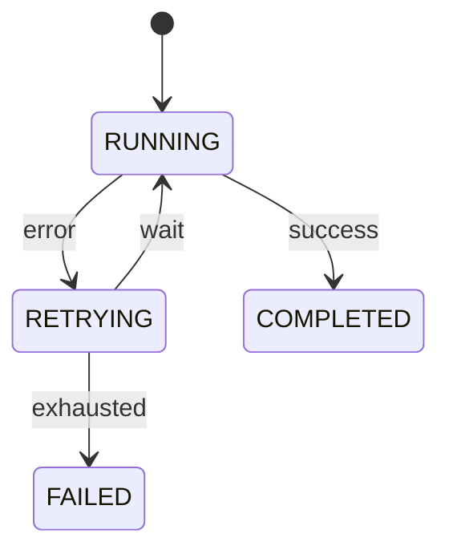

# 10. 重试与容错

## 一、为什么 LLM API 需要重试机制

LLM API 不是 100% 可靠的。在生产环境中，Agent Runtime 会频繁遇到：

- **速率限制（Rate Limit）**：Provider 限制每秒/每分钟的请求数
- **服务不可用（Service Unavailable）**：Provider 临时过载或维护
- **网络超时**：请求在传输过程中丢失或延迟
- **上下文超限（Context Overflow）**：请求超出模型的上下文窗口
- **内容过滤（Content Filter）**：输入或输出触发安全审查
- **模型内部错误**：LLM 偶尔产生无效输出（如截断的 JSON）

没有重试机制的 Agent 会在遇到这些问题时直接失败，用户体验极差。

## 二、重试策略设计

### 2.1 可恢复 vs 不可恢复错误

不是所有错误都值得重试：

| 错误类型 | 是否可恢复 | 重试策略 |
|----------|-----------|----------|
| 速率限制 (429) | 是 | 指数退避后重试 |
| 服务不可用 (503) | 是 | 指数退避后重试 |
| 网络超时 | 是 | 立即重试，最多 3 次 |
| 上下文超限 | 否（通常） | 触发 Compaction，不直接重试 |
| 内容过滤 | 否 | 向用户解释，不重试 |
| 无效认证 (401) | 否 | 需要用户更新凭据 |
| 模型内部错误 | 是（有时） | 重试 1-2 次 |

### 2.2 指数退避算法

```
function calculateBackoff(attempt: Integer, baseDelay: Integer, maxDelay: Integer): Integer:
    // 指数退避：delay = min(baseDelay * 2^attempt, maxDelay)
    delay = baseDelay * pow(2, attempt)
    return min(delay, maxDelay)

// 带抖动（Jitter）的退避，避免多个请求同时重试
function calculateBackoffWithJitter(attempt: Integer, baseDelay: Integer, maxDelay: Integer): Integer:
    base = calculateBackoff(attempt, baseDelay, maxDelay)
    jitter = random(0, base * 0.3)   // 最多 30% 的抖动
    return base + jitter
```

### 2.3 重试状态机

```
enum RetryState:
    IDLE
    ATTEMPTING      // 正在执行请求
    WAITING         // 等待退避时间
    SUCCESS
    EXHAUSTED       // 重试次数耗尽，最终失败

struct RetryContext:
    state: RetryState
    attemptCount: Integer           // 当前尝试次数
    maxAttempts: Integer            // 最大尝试次数（默认 3-5）
    baseDelay: Integer              // 基础延迟（毫秒，默认 1000）
    maxDelay: Integer               // 最大延迟（毫秒，默认 30000）
    lastError: Error
    errorHistory: List<Error>

function executeWithRetry(operation: Operation, context: RetryContext): Result:
    context.state = ATTEMPTING
    context.attemptCount += 1

    try:
        result = operation.execute()
        context.state = SUCCESS
        return Result.success(result)

    catch error:
        context.lastError = error
        context.errorHistory.append(error)

        if not error.isRetryable:
            context.state = EXHAUSTED
            return Result.failure(error)

        if context.attemptCount >= context.maxAttempts:
            context.state = EXHAUSTED
            return Result.failure(error)

        // 计算退避时间
        delay = calculateBackoffWithJitter(
            context.attemptCount,
            context.baseDelay,
            context.maxDelay
        )

        context.state = WAITING
        emitEvent("retry_scheduled", { attempt: context.attemptCount, delay })

        // 等待后退避
        sleep(delay)
        return executeWithRetry(operation, context)  // 递归重试
```

## 三、重试的粒度

重试可以在不同层级发生：

### 3.1 LLM 请求级重试

```
function callLlmWithRetry(request: ChatRequest): ChatResponse:
    retryContext = RetryContext {
        maxAttempts: 3,
        baseDelay: 1000,
        maxDelay: 30000
    }

    return executeWithRetry(
        operation: () -> llm.chat(request),
        context: retryContext
    )
```

### 3.2 Turn 级重试

如果整个 Turn 失败（如工具执行后 LLM 再次推理出错），可以重试整个 Turn：

```
function executeTurnWithRetry(session: Session, input: UserInput): Turn:
    retryContext = RetryContext {
        maxAttempts: 2,
        baseDelay: 2000
    }

    return executeWithRetry(
        operation: () -> executeTurn(session, input),
        context: retryContext
    )
```

### 3.3 Provider 级 Fallback

当重试耗尽时，可以切换到另一个 Provider：

```
function callLlmWithFallback(request: ChatRequest): ChatResponse:
    providers = getProviderChain(request.modelId)

    for provider in providers:
        try:
            return provider.chat(request)
        catch error:
            if error.isRetryable and provider != last:
                logWarning("Provider failed, trying fallback", provider.id, error)
                continue
            throw error
```

## 四、状态机中的重试表示

重试不是隐式发生的，应该在状态机中显式表示：



```
enum TurnStatus:
    IDLE
    RUNNING
    WAITING           // 等待用户输入
    RETRYING          // 正在重试（显示给用户）
    COMPLETED
    CANCELLED
    FAILED

function onRetry(context: TurnContext):
    transitionTurn(context.turn, to: RETRYING, reason: "llm_api_error")
    emitEvent("turn_retrying", {
        turnId: context.turn.id,
        attempt: context.retryContext.attemptCount,
        maxAttempts: context.retryContext.maxAttempts,
        nextAttemptIn: context.retryContext.nextDelay
    })
```

**为什么要显式表示 RETRYING 状态？**

- 用户需要知道系统没有卡住，而是在自动恢复
- UI 可以显示重试进度（"第 2/3 次尝试，3 秒后重试..."）
- 便于调试和监控（重试频率是系统健康度指标）

## 五、错误分类与处理

### 5.1 错误码标准化

```
enum ErrorCode:
    // 可恢复错误
    RATE_LIMITED              // 429
    SERVICE_UNAVAILABLE       // 503
    TIMEOUT                   // 网络超时
    MODEL_OVERLOADED          // 模型临时过载

    // 不可恢复错误（需要用户介入）
    AUTHENTICATION_FAILED     // 401
    PERMISSION_DENIED         // 403
    CONTEXT_OVERFLOW          // 上下文超限
    CONTENT_FILTERED          // 内容被过滤
    INVALID_REQUEST           // 请求格式错误

    // 内部错误
    INTERNAL_ERROR            // Provider 内部错误
    UNKNOWN_ERROR             // 未知错误

struct AgentError:
    code: ErrorCode
    message: String
    providerError: String       // 原始 Provider 错误信息
    isRetryable: Boolean
    suggestedAction: String     // 建议用户采取的行动
```

### 5.2 错误处理决策树

```
function handleError(error: AgentError, context: ExecutionContext):
    if error.code == RATE_LIMITED:
        // 读取 Provider 返回的 Retry-After 头
        retryAfter = error.providerHeaders["retry-after"]
        scheduleRetry(context, delay: retryAfter * 1000)

    else if error.code == CONTEXT_OVERFLOW:
        // 不能简单重试，需要先压缩上下文
        triggerCompaction(context.session)
        retryOperation(context)

    else if error.code == CONTENT_FILTERED:
        // 向用户解释，不重试
        emitEvent("content_filtered", {
            reason: error.message,
            suggestion: "Please rephrase your request"
        })

    else if error.code == AUTHENTICATION_FAILED:
        // 需要用户更新凭据
        emitEvent("credentials_required", {
            provider: context.providerId,
            error: error.message
        })

    else if error.isRetryable:
        scheduleRetry(context)

    else:
        // 不可恢复错误
        failTurn(context.turn, error)
```

## 六、熔断机制

连续失败时，应该暂时停止请求，避免雪崩效应。

```
class CircuitBreaker:
    state: "CLOSED" | "OPEN" | "HALF_OPEN"
    failureCount: Integer
    successCount: Integer
    failureThreshold: Integer      // 触发熔断的失败次数（如 5）
    recoveryTimeout: Integer       // 熔断后恢复时间（如 30000ms）
    lastFailureTime: Timestamp

    function call(operation: Operation):
        if state == OPEN:
            if now() - lastFailureTime > recoveryTimeout:
                state = HALF_OPEN
            else:
                throw CircuitBreakerOpenError("Service temporarily unavailable")

        try:
            result = operation.execute()
            onSuccess()
            return result
        catch error:
            onFailure()
            throw error

    function onSuccess():
        if state == HALF_OPEN:
            successCount += 1
            if successCount >= 3:   // 连续成功 3 次后关闭熔断
                state = CLOSED
                failureCount = 0
        else:
            failureCount = 0

    function onFailure():
        failureCount += 1
        lastFailureTime = now()
        if failureCount >= failureThreshold:
            state = OPEN
            emitEvent("circuit_breaker_opened", { failureCount })
```

## 七、最佳实践

1. **区分 "重试" 和 "Fallback"**：重试是同一 Provider 的再次尝试，Fallback 是切换 Provider
2. **重试次数要可配置**：不同环境（开发/生产）可能需要不同的重试策略
3. **给用户反馈**：重试时不应该静默进行，UI 应显示重试状态
4. **记录重试历史**：每次重试的尝试次数、错误原因、最终成功/失败都应该记录
5. **退避时间要合理**：太短的退避（如 100ms）对速率限制无效，太长的退避（如 5 分钟）影响体验
6. **区分幂等和非幂等操作**：工具执行通常不是幂等的，重试 Turn 时要避免重复执行副作用
7. **超时设置要分层**：连接超时（如 10s）、读取超时（如 60s）、总超时（如 5min）应该分别设置
