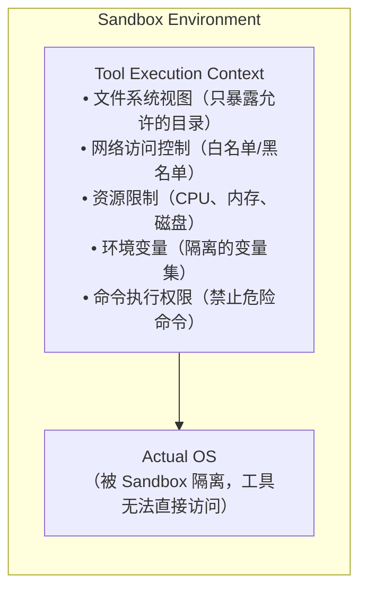

# 12. 沙箱与执行隔离

## 一、为什么需要沙箱

Agent 的工具可以执行任意代码、读写文件、访问网络。如果没有隔离：

- 一个恶意 Prompt 可能诱导 Agent 删除系统文件
- Agent 执行的错误命令可能破坏工作区
- 第三方工具可能包含安全漏洞
- 不同 Agent/会话之间可能互相干扰

**沙箱（Sandbox）是 Agent Runtime 的最后一道安全防线**。

## 二、沙箱的核心能力



沙箱必须控制以下维度：

| 维度 | 控制目标 | 典型限制 |
|------|----------|----------|
| **文件系统** | 防止未授权读写 | 只暴露工作目录，禁止访问 `~/.ssh`、系统目录 |
| **网络** | 防止数据外泄和恶意访问 | 白名单域名，禁止访问内网敏感端口 |
| **进程** | 防止资源耗尽和僵尸进程 | 限制 CPU 时间、内存、进程数 |
| **命令** | 防止破坏性操作 | 禁止 `rm -rf /`、`dd`、`mkfs` 等 |
| **环境** | 防止信息泄露 | 隔离环境变量，隐藏敏感配置 |

## 三、沙箱的实现策略

### 3.1 策略对比

| 策略 | 隔离级别 | 性能 | 复杂度 | 适用场景 |
|------|----------|------|--------|----------|
| **进程级限制** | 低 | 高 | 低 | 开发环境、可信代码 |
| **chroot / 容器** | 中 | 中 | 中 | 通用工具执行 |
| **系统级沙箱** | 高 | 中 | 高 | 不可信代码、生产环境 |
| **虚拟机** | 最高 | 低 | 高 | 极端隔离需求 |

### 3.2 进程级限制（最轻量）

```
function executeInSandbox(command: String, config: SandboxConfig):
    process = createProcess()

    // 文件系统限制
    process.setWorkingDirectory(config.allowedDirectory)
    process.setRootDirectory(config.allowedDirectory)   // chroot

    // 资源限制
    process.setMaxMemory(config.maxMemoryMb * 1024 * 1024)
    process.setMaxCpuTime(config.maxCpuTimeSeconds)
    process.setMaxOutputSize(config.maxOutputSizeBytes)

    // 网络限制
    if not config.allowNetwork:
        process.disableNetwork()
    else:
        process.setNetworkPolicy(config.allowedDomains, config.blockedDomains)

    // 环境变量
    process.setEnvironment(config.environmentVariables)

    // 执行
    result = process.run(command, timeout: config.timeoutSeconds)

    // 清理
    process.destroy()
    return result
```

### 3.3 容器化沙箱

```
function executeInContainer(command: String, config: ContainerConfig):
    container = containerRuntime.create({
        image: config.baseImage,           // 如 "ubuntu:22.04"
        volumes: {
            config.workspacePath: "/workspace"   // 只挂载工作目录
        },
        network: config.allowNetwork ? "bridge" : "none",
        memory: config.maxMemoryMb + "m",
        cpus: config.maxCpus,
        timeout: config.timeoutSeconds,
        readOnlyRootFilesystem: true,      // 根文件系统只读
        securityOptions: ["no-new-privileges"]  // 禁止提权
    })

    result = container.run(command)
    container.destroy()
    return result
```

### 3.4 系统级沙箱（以 Seatbelt 为例）

```
// Seatbelt 是 macOS 的强制访问控制沙箱
function executeWithSeatbelt(command: String, profile: SeatbeltProfile):
    sandboxProfile = generateSeatbeltProfile(profile)

    // 生成的配置文件示例：
    // (version 1)
    // (deny default)
    // (allow file-read* (subpath "/workspace"))
    // (allow file-write* (subpath "/workspace"))
    // (allow network-outbound (remote ip "localhost:*"))
    // (deny network-outbound)

    process = createProcess()
    process.applySandbox(sandboxProfile)
    return process.run(command)
```

## 四、文件系统隔离

### 4.1 文件访问策略

```
struct FileSystemPolicy:
    allowedPaths: List<String>         // 显式允许的路径
    blockedPaths: List<String>         // 显式禁止的路径
    allowWrite: Boolean                // 是否允许写操作
    allowDelete: Boolean               // 是否允许删除
    maxFileSize: Integer               // 最大文件大小（字节）
    allowedExtensions: List<String>    // 允许的文件扩展名（可选）

// 路径匹配算法
function isPathAllowed(path: String, policy: FileSystemPolicy): Boolean:
    // 1. 检查是否在禁止列表中
    for blocked in policy.blockedPaths:
        if path.startsWith(blocked) or path.matches(blocked):
            return false

    // 2. 检查是否在允许列表中
    for allowed in policy.allowedPaths:
        if path.startsWith(allowed) or path.matches(allowed):
            return true

    // 3. 默认拒绝
    return false
```

### 4.2 常见的禁止路径

```
blockedPaths = [
    "~/.ssh/*",           // SSH 密钥
    "~/.aws/*",           // AWS 凭证
    "~/.docker/*",        // Docker 配置
    "~/.npmrc",           // NPM 认证
    "~/.git-credentials", // Git 凭证
    "/etc/passwd",        // 系统用户列表
    "/etc/shadow",        // 密码哈希
    "*.key",              // 所有密钥文件
    "*.pem",              // 证书文件
]
```

## 五、网络隔离

### 5.1 网络策略模型

```
enum NetworkPolicy:
    NONE        // 完全禁止网络
    RESTRICTED  // 只允许白名单域名
    PROXIED     // 通过代理访问，代理可做审查
    FULL        // 允许所有网络访问（不推荐）

struct NetworkPolicyConfig:
    policy: NetworkPolicy
    allowedDomains: List<String>
    blockedDomains: List<String>
    blockedPorts: List<Integer>    // 禁止访问的端口（如 22, 3306）
    proxyUrl: String               // 代理地址（如果使用 PROXIED）
    maxRequestSize: Integer        // 最大请求体
    maxResponseSize: Integer       // 最大响应体
    timeout: Integer               // 请求超时
```

### 5.2 网络请求审查

```
function reviewNetworkRequest(request: NetworkRequest, policy: NetworkPolicyConfig):
    // 1. 域名检查
    domain = extractDomain(request.url)
    if not policy.allowedDomains.contains(domain):
        return ReviewResult {
            allowed: false,
            reason: "Domain '" + domain + "' is not in the allowed list"
        }

    // 2. 端口检查
    port = extractPort(request.url)
    if policy.blockedPorts.contains(port):
        return ReviewResult {
            allowed: false,
            reason: "Port " + port + " is blocked"
        }

    // 3. 内容检查（防止数据外泄）
    if request.body:
        if containsSensitiveData(request.body):
            return ReviewResult {
                allowed: false,
                reason: "Request body may contain sensitive data"
            }

    return ReviewResult { allowed: true }
```

## 六、命令执行隔离

### 6.1 危险命令黑名单

```
dangerousCommands = [
    "rm -rf /",           // 删除整个文件系统
    "dd if=/dev/zero",    // 覆写磁盘
    "mkfs",               // 格式化文件系统
    ":(){ :|:& };:",      // Fork 炸弹
    "wget -O- | sh",      // 执行远程脚本
    "curl | sh",          // 同上
    "eval",               // 执行任意代码
    "exec",               // 替换当前进程
]

function isDangerousCommand(command: String): Boolean:
    for pattern in dangerousCommands:
        if command.contains(pattern):
            return true

    // 更复杂的分析：使用 AST 解析命令
    parsed = parseCommand(command)
    if parsed.hasDestructiveOperation and not parsed.hasConfirmationFlag:
        return true

    return false
```

### 6.2 命令执行沙箱配置

```
struct CommandSandboxConfig:
    allowedCommands: List<String>      // 白名单（如果设置，只允许这些命令）
    blockedCommands: List<String>      // 黑名单
    requireConfirmation: List<String>  // 需要用户确认的命令模式
    timeout: Integer                   // 命令超时（秒）
    maxOutputLines: Integer            // 最大输出行数
    environment: Map<String, String>   // 隔离的环境变量
```

## 七、Auto-escalation（自动升级）

当沙箱阻止某个操作时，Runtime 可以自动调整策略：

```
function handleSandboxDenial(toolCall: ToolCall, denialReason: String):
    // 1. 记录拒绝
    logSandboxDenial(toolCall, denialReason)

    // 2. 分析是否可以安全升级
    if canSafelyEscalate(toolCall):
        // 询问用户是否升级沙箱
        decision = await askUser({
            title: "Operation Blocked by Sandbox",
            description: "The Agent wants to: " + toolCall.name +
                        "(" + toolCall.arguments + ")\n" +
                        "This was blocked because: " + denialReason,
            options: [
                "Allow this time",
                "Always allow for this session",
                "Deny"
            ]
        })

        if decision == "Allow this time":
            return executeWithElevatedSandbox(toolCall)
        else if decision == "Always allow for this session":
            session.sandboxPolicy = escalatePolicy(session.sandboxPolicy, toolCall)
            return executeWithElevatedSandbox(toolCall)

    // 3. 无法升级，返回错误
    return ToolResult {
        status: "error",
        content: "Operation blocked by sandbox: " + denialReason,
        isError: true
    }
```

## 八、沙箱的最佳实践

1. **默认拒绝原则**：沙箱默认应该限制一切，只显式允许必要的操作
2. **沙箱策略要可配置**：不同场景（个人开发、CI/CD、生产）需要不同的安全级别
3. **沙箱拒绝要可观测**：每次沙箱拒绝都要记录原因，便于调试
4. **区分 "读取" 和 "写入"**：读取操作的安全风险远低于写入操作
5. **定期审查沙箱日志**：发现 Agent 频繁触发沙箱限制时，可能意味着需要调整策略或 Agent 行为有问题
6. **沙箱不能替代权限系统**：沙箱是最后的防线，权限系统是主动控制
7. **测试沙箱配置**：用已知危险的操作测试沙箱是否能正确阻止
8. **考虑平台差异**：不同操作系统（macOS、Linux、Windows）的沙箱机制不同，Runtime 应该适配多种机制
