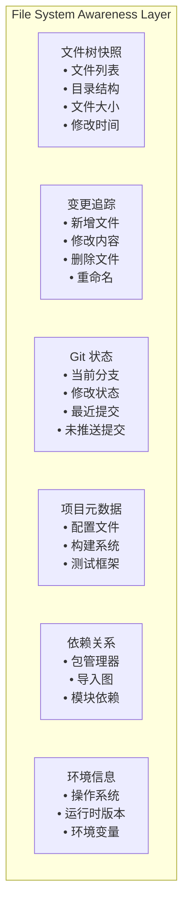

# 13. 文件系统感知

## 一、为什么 Agent 需要文件系统感知

Agent 不能仅靠用户输入来理解工作区。用户说"修复那个 bug"，Agent 需要知道：

- 工作区有哪些文件？
- 最近修改了什么？
- Git 分支和状态是什么？
- 项目结构是怎样的？

**文件系统感知**让 Agent 能够持续、自动地获取工作区的上下文信息，而不是每次依赖用户手动提供。

## 二、感知维度



## 三、文件树快照

### 3.1 快照捕获

```
struct FileSystemSnapshot:
    rootPath: String
    capturedAt: Timestamp
    entries: List<FileEntry>

struct FileEntry:
    path: String                // 相对路径
    type: "file" | "directory" | "symlink"
    size: Integer
    modifiedAt: Timestamp
    hash: String                // 内容哈希（用于检测变更）

function captureSnapshot(rootPath: String): FileSystemSnapshot:
    entries = []
    for file in walkDirectory(rootPath, exclude: [".git", "node_modules", ".env"]):
        entries.append(FileEntry {
            path: relativePath(file, rootPath),
            type: getFileType(file),
            size: getFileSize(file),
            modifiedAt: getModifiedTime(file),
            hash: computeHash(file)
        })

    return FileSystemSnapshot {
        rootPath: rootPath,
        capturedAt: now(),
        entries: entries
    }
```

### 3.2 快照对比（Diff）

```
function computeSnapshotDiff(oldSnapshot: FileSystemSnapshot,
                              newSnapshot: FileSystemSnapshot): SnapshotDiff:
    changes = []

    // 检测新增和修改
    for newEntry in newSnapshot.entries:
        oldEntry = oldSnapshot.findEntry(newEntry.path)
        if oldEntry == null:
            changes.append(Change { type: "added", path: newEntry.path, entry: newEntry })
        else if oldEntry.hash != newEntry.hash:
            changes.append(Change {
                type: "modified",
                path: newEntry.path,
                before: oldEntry,
                after: newEntry
            })

    // 检测删除
    for oldEntry in oldSnapshot.entries:
        if newSnapshot.findEntry(oldEntry.path) == null:
            changes.append(Change { type: "deleted", path: oldEntry.path, entry: oldEntry })

    return SnapshotDiff { changes: changes }
```

## 四、变更追踪

### 4.1 文件监视器

```
class FileWatcher:
    watchedPaths: List<String>
    onChange: Callback

    function startWatching(paths: List<String>):
        for path in paths:
            watchPath = registerFsWatcher(path)
            watchPath.onEvent = handleFsEvent

    function handleFsEvent(event: FsEvent):
        change = FileChange {
            path: event.path,
            type: event.type,           // created / modified / deleted / renamed
            timestamp: now()
        }

        // 去重：如果同一文件在短时间内多次变更，合并为一次
        if recentChanges.contains(change.path):
            recentChanges[change.path].timestamp = now()
        else:
            recentChanges[change.path] = change

        onChange(change)

    function getRecentChanges(since: Timestamp): List<FileChange>:
        return recentChanges.values().filter(c -> c.timestamp > since)
```

### 4.2 变更注入到对话

当检测到文件变更时，Runtime 可以自动将变更信息注入到 Agent 的上下文中：

```
function onFileChange(change: FileChange):
    if change.type == "modified":
        diff = computeFileDiff(change.path)

        // 创建内部消息注入上下文
        message = createInternalMessage({
            role: "system",
            parts: [PatchPart {
                path: change.path,
                diff: diff,
                before: diff.before,
                after: diff.after
            }],
            visibility: "internal"
        })

        session.addMessage(message)
        emitEvent("file_change_injected", { path: change.path, diffLength: diff.length })
```

## 五、Git 状态集成

### 5.1 Git 信息收集

```
struct GitInfo:
    isGitRepository: Boolean
    branch: String
    commitHash: String
    commitMessage: String
    author: String
    status: GitStatus
    ahead: Integer              // 领先远程的提交数
    behind: Integer             // 落后远程的提交数

struct GitStatus:
    modified: List<String>
    added: List<String>
    deleted: List<String>
    untracked: List<String>
    conflicted: List<String>

function collectGitInfo(workingDirectory: String): GitInfo:
    if not isGitRepository(workingDirectory):
        return GitInfo { isGitRepository: false }

    return GitInfo {
        isGitRepository: true,
        branch: execute("git branch --show-current"),
        commitHash: execute("git rev-parse HEAD"),
        commitMessage: execute("git log -1 --pretty=%B"),
        status: parseGitStatus(execute("git status --porcelain")),
        aheadBehind: parseAheadBehind(execute("git rev-list --left-right --count HEAD...@{u}"))
    }
```

### 5.2 Git 信息的用途

```
function injectGitContext(session: Session):
    gitInfo = collectGitInfo(session.workingDirectory)

    if not gitInfo.isGitRepository:
        return

    context = "Git Context:\n"
    context += "- Branch: " + gitInfo.branch + "\n"
    context += "- Status: " + formatGitStatus(gitInfo.status) + "\n"

    if gitInfo.ahead > 0:
        context += "- Ahead of remote by " + gitInfo.ahead + " commits\n"

    if gitInfo.status.conflicted.isNotEmpty():
        context += "- Warning: " + gitInfo.status.conflicted.length + " merge conflicts\n"

    session.addSystemContext(context)
```

## 六、项目结构理解

### 6.1 项目类型检测

```
function detectProjectType(directory: String): ProjectType:
    if fileExists(directory + "/package.json"):
        return ProjectType.NODEJS
    if fileExists(directory + "/Cargo.toml"):
        return ProjectType.RUST
    if fileExists(directory + "/go.mod"):
        return ProjectType.GO
    if fileExists(directory + "/requirements.txt") or fileExists(directory + "/pyproject.toml"):
        return ProjectType.PYTHON
    if fileExists(directory + "/pom.xml") or fileExists(directory + "/build.gradle"):
        return ProjectType.JAVA
    if fileExists(directory + "/Dockerfile"):
        return ProjectType.DOCKER

    return ProjectType.UNKNOWN
```

### 6.2 项目元数据收集

```
function collectProjectMetadata(directory: String): ProjectMetadata:
    metadata = ProjectMetadata {
        type: detectProjectType(directory),
        rootDirectory: directory
    }

    if metadata.type == ProjectType.NODEJS:
        packageJson = readJson(directory + "/package.json")
        metadata.name = packageJson.name
        metadata.dependencies = packageJson.dependencies
        metadata.scripts = packageJson.scripts
        metadata.hasTests = fileExists(directory + "/package.json") and
                           (fileExists(directory + "/jest.config.js") or
                            fileExists(directory + "/vitest.config.ts"))

    else if metadata.type == ProjectType.RUST:
        cargoToml = readToml(directory + "/Cargo.toml")
        metadata.name = cargoToml.package.name
        metadata.dependencies = cargoToml.dependencies

    return metadata
```

## 七、环境上下文

### 7.1 运行时环境

```
struct EnvironmentContext:
    os: String                  // "macOS", "Linux", "Windows"
    osVersion: String
    architecture: String        // "x86_64", "arm64"
    shell: String               // "/bin/zsh", "/bin/bash"
    availableTools: List<String> // 系统上可用的命令

function collectEnvironmentContext(): EnvironmentContext:
    return EnvironmentContext {
        os: getOperatingSystem(),
        osVersion: getOsVersion(),
        architecture: getArchitecture(),
        shell: getDefaultShell(),
        availableTools: detectAvailableTools()
    }
```

### 7.2 环境信息的注入

```
function injectEnvironmentContext(session: Session):
    env = collectEnvironmentContext()

    context = "Environment:\n"
    context += "- OS: " + env.os + " " + env.osVersion + "\n"
    context += "- Shell: " + env.shell + "\n"
    context += "- Working directory: " + session.workingDirectory + "\n"

    session.addSystemContext(context)
```

## 八、文件系统感知的最佳实践

1. **快照是按需的，不是持续的**：全量快照有开销，应该在 Turn 开始时捕获，而不是持续监视所有文件
2. **关注变更，而非全量**：使用文件监视器追踪变更，只将变更信息注入上下文
3. **尊重 .gitignore**：文件系统感知应该遵循项目的 .gitignore，避免追踪无关文件
4. **区分 "工作区" 和 "系统"**：Agent 只应该感知工作区内的文件，不应该扫描用户的整个文件系统
5. **变更信息要简洁**：不要注入整个文件内容，只注入变更摘要（文件名、变更类型、影响行数）
6. **避免信息过载**：如果一次变更涉及 100 个文件，应该总结为"大量文件变更"而非列出每个文件
7. **Git 状态是高频变化的**：不要在每条消息中都注入完整 Git 状态，只在相关时注入（如用户询问"我的修改在哪"时）
8. **项目元数据可以缓存**：项目类型和依赖关系不会频繁变化，可以缓存并定期刷新
