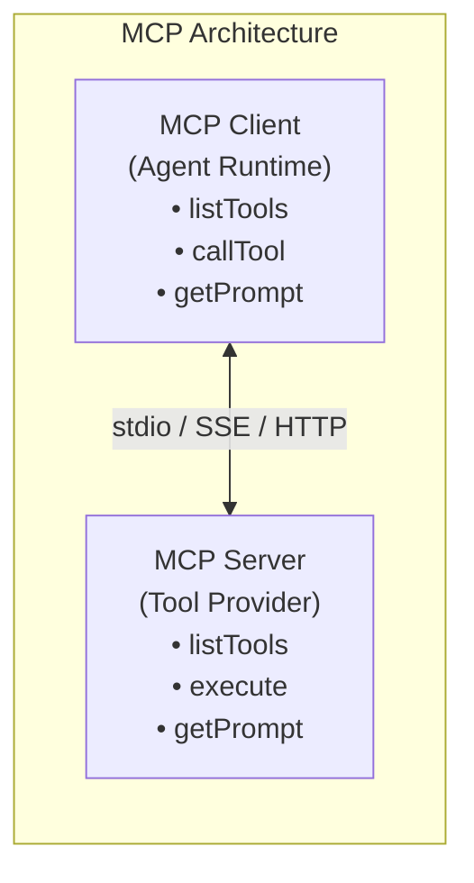

# 14. MCP 兼容性

## 一、什么是 MCP

MCP（Model Context Protocol）是一个开放协议，用于标准化 AI 模型与外部工具、数据源之间的通信。

在没有 MCP 之前，每个 Agent 项目都有自己的工具实现方式：
- Agent A 实现了 `read_file` 工具
- Agent B 实现了 `file_read` 工具（功能相同，接口不同）
- Agent C 实现了完全不同的工具集

MCP 的目标是：**工具一次实现，到处使用**。

## 二、MCP 的核心概念



### 2.1 MCP Server 的能力

MCP Server 可以向 Client 暴露三种能力：

| 能力 | 说明 |
|------|------|
| **Tools** | 可执行的工具（如文件操作、API 调用、数据库查询） |
| **Resources** | 只读的数据源（如文件内容、数据库表、API 响应） |
| **Prompts** | 预定义的提示词模板 |

### 2.2 通信协议

MCP 使用 JSON-RPC 2.0 进行通信：

```
// Client -> Server: 列出可用工具
{
    "jsonrpc": "2.0",
    "id": 1,
    "method": "tools/list",
    "params": {}
}

// Server -> Client: 返回工具列表
{
    "jsonrpc": "2.0",
    "id": 1,
    "result": {
        "tools": [
            {
                "name": "read_file",
                "description": "Read contents of a file",
                "inputSchema": {
                    "type": "object",
                    "properties": {
                        "path": { "type": "string" }
                    },
                    "required": ["path"]
                }
            },
            {
                "name": "search_files",
                "description": "Search for files matching a pattern",
                "inputSchema": { ... }
            }
        ]
    }
}

// Client -> Server: 调用工具
{
    "jsonrpc": "2.0",
    "id": 2,
    "method": "tools/call",
    "params": {
        "name": "read_file",
        "arguments": { "path": "/src/main.js" }
    }
}

// Server -> Client: 返回结果
{
    "jsonrpc": "2.0",
    "id": 2,
    "result": {
        "content": [
            {
                "type": "text",
                "text": "function main() { console.log('hello'); }"
            }
        ],
        "isError": false
    }
}
```

## 三、Agent Runtime 中的 MCP Client

### 3.1 Client 的核心职责

```
interface McpClient:
    function connect(transport: Transport): void
    function disconnect(): void
    function listTools(): List<McpToolDefinition>
    function callTool(name: String, arguments: Json): McpToolResult
    function listResources(): List<McpResource>
    function readResource(uri: String): McpResourceContent
    function listPrompts(): List<McpPrompt>
    function getPrompt(name: String, arguments: Json): String
```

### 3.2 连接管理

```
class McpConnectionManager:
    connections: Map<String, McpConnection>

    function connectServer(config: McpServerConfig):
        // MCP Server 可以通过多种方式启动
        if config.type == "stdio":
            // 启动本地进程，通过 stdin/stdout 通信
            process = spawnProcess(config.command, config.args)
            transport = StdioTransport(process)
        else if config.type == "sse":
            // 通过 Server-Sent Events 连接远程服务
            transport = SseTransport(config.url)
        else if config.type == "http":
            // 通过 HTTP 连接
            transport = HttpTransport(config.url)

        client = McpClient()
        client.connect(transport)

        // 握手：获取 Server 信息
        serverInfo = client.initialize({
            clientName: "MyAgent",
            clientVersion: "1.0.0",
            protocolVersion: "2024-11-05"
        })

        connections[config.id] = McpConnection {
            client: client,
            transport: transport,
            serverInfo: serverInfo
        }

    function disconnectServer(serverId: String):
        connection = connections[serverId]
        connection.client.disconnect()
        connection.transport.close()
        connections.remove(serverId)
```

### 3.3 工具桥接

MCP 工具需要桥接到 Agent 的 Tool Registry：

```
function bridgeMcpTools(connection: McpConnection, registry: ToolRegistry):
    mcpTools = connection.client.listTools()

    for mcpTool in mcpTools:
        // 包装 MCP 工具为 Agent 工具
        agentTool = ToolDefinition {
            name: mcpTool.name,
            description: mcpTool.description,
            parameters: mcpTool.inputSchema,
            executor: createMcpExecutor(connection, mcpTool.name)
        }

        registry.register(agentTool)

function createMcpExecutor(connection: McpConnection, toolName: String):
    return function(arguments: Json): ToolResult:
        try:
            result = connection.client.callTool(toolName, arguments)
            return ToolResult {
                status: "success",
                content: serializeMcpContent(result.content),
                isError: result.isError
            }
        catch error:
            return ToolResult {
                status: "error",
                content: "MCP tool error: " + error.message,
                isError: true
            }
```

## 四、MCP Server 的发现与配置

### 4.1 配置文件

```
// mcp-config.json
{
    "servers": [
        {
            "id": "filesystem",
            "name": "File System Tools",
            "type": "stdio",
            "command": "npx",
            "args": ["-y", "@modelcontextprotocol/server-filesystem", "/home/user/project"],
            "enabled": true
        },
        {
            "id": "github",
            "name": "GitHub Integration",
            "type": "sse",
            "url": "https://mcp-github.example.com/sse",
            "headers": {
                "Authorization": "Bearer ${GITHUB_TOKEN}"
            },
            "enabled": false
        }
    ]
}
```

### 4.2 动态发现

```
function discoverMcpServers(): List<McpServerConfig>:
    configs = []

    // 1. 从配置文件加载
    configs.appendAll(loadFromConfigFile("~/.config/mcp/servers.json"))

    // 2. 从项目目录加载
    if fileExists("./.mcp.json"):
        configs.appendAll(loadFromConfigFile("./.mcp.json"))

    // 3. 从环境变量加载
    if env["MCP_SERVERS"]:
        configs.appendAll(parseEnvConfig(env["MCP_SERVERS"]))

    return configs
```

## 五、MCP 与 Agent 的集成模式

### 5.1 启动时加载

```
function initializeMcpIntegration(runtime: AgentRuntime):
    configs = discoverMcpServers()

    for config in configs:
        if not config.enabled:
            continue

        try:
            connection = mcpManager.connectServer(config)
            bridgeMcpTools(connection, runtime.toolRegistry)
            emitEvent("mcp_server_connected", { id: config.id, tools: connection.tools.length })
        catch error:
            logWarning("Failed to connect MCP server", config.id, error)
            // 继续连接其他 Server，不要因为一个失败而中断
```

### 5.2 运行时热加载

```
function onMcpConfigChanged():
    newConfigs = discoverMcpServers()
    currentConnections = mcpManager.connections

    // 断开已移除的 Server
    for id in currentConnections.keys:
        if id not in newConfigs.map(c -> c.id):
            mcpManager.disconnectServer(id)
            runtime.toolRegistry.unregisterMcpTools(id)

    // 连接新增的 Server
    for config in newConfigs:
        if config.id not in currentConnections and config.enabled:
            connection = mcpManager.connectServer(config)
            bridgeMcpTools(connection, runtime.toolRegistry)
```

## 六、错误处理与降级

### 6.1 MCP Server 故障

```
function handleMcpError(connection: McpConnection, error: McpError):
    if error.code == "connection_lost":
        // 尝试重连
        attemptReconnect(connection, maxAttempts: 3)

    else if error.code == "tool_not_found":
        // Server 可能已更新，重新同步工具列表
        syncTools(connection)

    else if error.code == "execution_timeout":
        // 工具执行超时，返回超时错误
        return ToolResult {
            status: "error",
            content: "Tool execution timed out. The operation may be too complex.",
            isError: true
        }

    else:
        // 未知错误，记录并返回
        logError("MCP error", error)
        return ToolResult {
            status: "error",
            content: "MCP server error: " + error.message,
            isError: true
        }
```

### 6.2 降级策略

当 MCP Server 不可用时，Agent 应该能降级到内置工具：

```
function executeTool(toolCall: ToolCall): ToolResult:
    // 优先使用 MCP 工具
    if mcpRegistry.hasTool(toolCall.name):
        return mcpRegistry.execute(toolCall)

    // MCP 不可用时，回退到内置工具
    if builtinRegistry.hasTool(toolCall.name):
        logInfo("Falling back to builtin tool", toolCall.name)
        return builtinRegistry.execute(toolCall)

    return ToolResult {
        status: "error",
        content: "Tool '" + toolCall.name + "' is not available",
        isError: true
    }
```

## 七、MCP 的优势与局限

### 7.1 优势

1. **生态共享**：一个 MCP Server（如 GitHub 集成）可以被多个 Agent 使用
2. **语言无关**：MCP Server 可以用任何语言实现，Agent 用任何语言消费
3. **进程隔离**：MCP Server 运行在独立进程中，崩溃不影响 Agent
4. **标准化**：统一的工具描述、调用、错误处理协议
5. **动态发现**：Agent 可以在运行时发现和加载新的工具能力

### 7.2 局限

1. **网络开销**：跨进程通信比内置工具慢
2. **部署复杂**：需要额外安装和配置 MCP Server
3. **状态同步**：MCP Server 和 Agent 之间的状态同步需要额外处理
4. **错误传播**：MCP Server 的错误需要正确映射到 Agent 的错误体系

## 八、最佳实践

1. **优先内置，补充 MCP**：核心工具（文件读写）应该内置，外部能力（GitHub、数据库）通过 MCP
2. **MCP 工具名加命名空间**：如 `github_create_issue` 而非 `create_issue`，避免冲突
3. **连接失败要优雅降级**：不要因为一个 MCP Server 连接失败就阻止 Agent 启动
4. **定期心跳检测**：检测 MCP Server 是否还活着，及时清理无效连接
5. **工具列表缓存**：`listTools` 的结果可以缓存，不要每次调用前都重新获取
6. **限制 MCP 工具数量**：太多工具会降低 LLM 的工具选择准确率，只加载必要的
7. **文档 MCP 工具的使用方式**：在 Agent 的 System Prompt 中说明 MCP 工具的存在和用途
