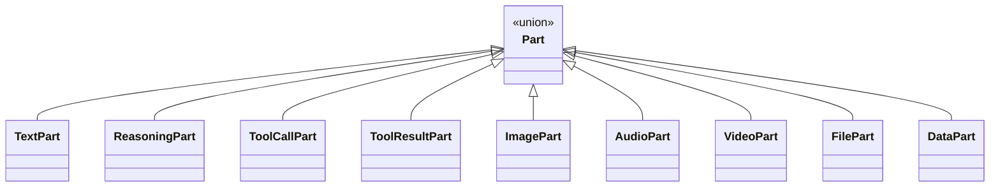
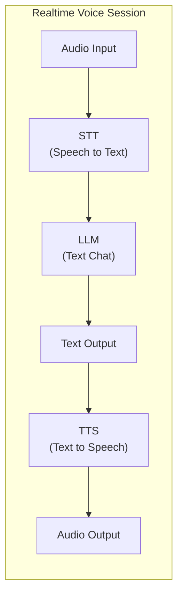

# 15. 多模态支持

## 一、Agent 正在从文本走向多模态

当前大多数 Agent 只处理文本，但 LLM 的能力早已扩展到：

- **图像理解**：分析截图、图表、UI 设计稿
- **语音对话**：实时语音交互，无需打字
- **文档解析**：处理 PDF、Word、Excel 等非文本格式
- **视频分析**：理解视频内容（新兴能力）

Agent Runtime 的架构应该**预留多模态的扩展通道**，而不是假设所有输入输出都是文本。

## 二、多模态消息模型

Part-based 消息模型天然支持多模态扩展：



```
union Part:
    // 文本（已存在）
    TextPart          { content: String }

    // 推理过程（已存在）
    ReasoningPart     { content: String, signature: String }

    // 工具（已存在）
    ToolCallPart      { id: String, name: String, arguments: Json }
    ToolResultPart    { toolCallId: String, content: String, isError: Boolean }

    // ─── 多模态扩展 ───

    // 图像
    ImagePart {
        source: ImageSource,           // URL / Base64 / File Path
        mimeType: String,              // "image/png", "image/jpeg"
        dimensions: { width: Integer, height: Integer },
        altText: String                // 可访问性描述
    }

    // 音频
    AudioPart {
        source: AudioSource,
        mimeType: String,              // "audio/mp3", "audio/wav"
        duration: Integer,             // 毫秒
        transcript: String             // 语音转文本（如果有）
    }

    // 视频
    VideoPart {
        source: VideoSource,
        mimeType: String,              // "video/mp4"
        duration: Integer,
        thumbnail: ImageSource         // 视频缩略图
    }

    // 文件附件
    FilePart {
        path: String,
        content: String,               // 文本内容或 Base64
        mimeType: String,
        size: Integer
    }

    // 结构化数据
    DataPart {
        format: "json" | "csv" | "yaml",
        content: String,
        schema: JsonSchema             // 数据 schema（可选）
    }
```

## 三、图像输入的处理

### 3.1 图像的获取方式

```
enum ImageSource:
    UrlSource      { url: String }
    Base64Source   { data: String, mimeType: String }
    FileSource     { path: String }
    ClipboardSource { }              // 从剪贴板获取
    ScreenshotSource { region: Region }  // 屏幕截图
```

### 3.2 图像消息的构建

```
// 用户上传截图询问错误
Message {
    role: "user",
    parts: [
        TextPart { content: "I'm getting this error. What does it mean?" },
        ImagePart {
            source: FileSource { path: "/tmp/screenshot.png" },
            mimeType: "image/png",
            dimensions: { width: 1920, height: 1080 }
        }
    ]
}

// Agent 的回复可能引用图像中的内容
Message {
    role: "assistant",
    parts: [
        TextPart { content: "The error in your screenshot shows a null pointer exception at line 42 of auth.js. This happens when..." },
        ToolCallPart {
            name: "read_file",
            arguments: { path: "/src/auth.js", offset: 35, limit: 15 }
        }
    ]
}
```

### 3.3 图像大小限制

不同 Provider 对图像大小有不同限制：

```
function validateImage(image: ImagePart, provider: Provider): ValidationResult:
    maxSize = provider.getMaxImageSize()      // 如 20MB
    maxDimensions = provider.getMaxImageDimensions()  // 如 8192x8192

    if image.size > maxSize:
        return ValidationResult {
            valid: false,
            reason: "Image size " + image.size + " exceeds limit " + maxSize
        }

    if image.dimensions.width > maxDimensions.width or
       image.dimensions.height > maxDimensions.height:
        return ValidationResult {
            valid: false,
            reason: "Image dimensions exceed limit"
        }

    return ValidationResult { valid: true }
```

## 四、实时语音交互

### 4.1 语音对话架构



### 4.2 流式语音处理

```
class RealtimeVoiceSession:
    audioInputStream: Stream<AudioChunk>
    audioOutputStream: Stream<AudioChunk>

    function start():
        // 1. 启动音频捕获
        audioInputStream = startAudioCapture()

        // 2. 语音转文本（流式）
        textStream = speechToText.transcribeStream(audioInputStream)

        // 3. 文本送入 Agent
        for textChunk in textStream:
            if isCompleteUtterance(textChunk):
                // 用户说完了一句话，送入 Agent
                message = createUserMessage([TextPart { content: textChunk.text }])
                response = agent.processMessage(message)

                // 4. 文本转语音
                audioOutput = textToSpeech.synthesize(response.text)
                audioOutputStream.emit(audioOutput)

    function isCompleteUtterance(chunk: TextChunk): Boolean:
        // 检测用户是否停顿足够长，表示一句话结束
        return chunk.silenceDuration > 1000  // 1 秒静音
```

### 4.3 语音交互的特殊考虑

| 问题 | 解决方案 |
|------|----------|
| **打断** | 用户说话时应中断 Agent 的语音输出 |
| **双工** | 支持同时听和说（高级场景） |
| **噪声** | 语音活动检测（VAD）过滤背景噪音 |
| **延迟** | 使用流式 STT 和 TTS，减少端到端延迟 |
| **唤醒词** | 支持 "Hey Agent" 等唤醒机制 |

## 五、文档解析

### 5.1 文档转文本

Agent 经常需要处理非纯文本文件：

```
function extractTextFromDocument(filePath: String): DocumentContent:
    mimeType = detectMimeType(filePath)

    if mimeType == "application/pdf":
        return pdfParser.parse(filePath)
    else if mimeType == "application/vnd.openxmlformats-officedocument.wordprocessingml.document":
        return docxParser.parse(filePath)
    else if mimeType == "application/vnd.openxmlformats-officedocument.spreadsheetml.sheet":
        return xlsxParser.parse(filePath)
    else if mimeType == "text/markdown":
        return markdownParser.parse(filePath)
    else if mimeType.startsWith("image/"):
        // 对于图像，使用 OCR
        return ocrEngine.recognize(filePath)
    else:
        return DocumentContent {
            text: readAsText(filePath),
            format: "plain"
        }
```

### 5.2 文档内容的注入

```
function injectDocumentContent(session: Session, filePath: String):
    doc = extractTextFromDocument(filePath)

    message = createUserMessage({
        parts: [
            TextPart { content: "Please analyze this document:" },
            FilePart {
                path: filePath,
                content: doc.text,
                mimeType: doc.mimeType,
                size: doc.size
            }
        ]
    })

    session.addMessage(message)
```

## 六、多模态的 Provider 抽象

多模态能力在不同 Provider 之间的差异比纯文本更大，抽象层需要处理：

### 6.1 Provider 能力矩阵

| 能力 | OpenAI | Anthropic | Google | 本地模型 |
|------|--------|-----------|--------|----------|
| 图像输入 | GPT-4V | Claude 3 | Gemini | 部分支持 |
| 语音输入 | Whisper | 否 | 部分支持 | 部分支持 |
| 语音输出 | TTS | 否 | 部分支持 | 部分支持 |
| 视频输入 | 否 | 否 | Gemini | 否 |
| 文档解析 | 否 | 否 | 部分支持 | 否 |

### 6.2 能力协商

```
function negotiateCapabilities(request: MultimodalRequest, provider: Provider): Request:
    // 检查 Provider 是否支持请求中的所有模态
    for part in request.parts:
        if part is ImagePart and not provider.supportsImageInput():
            // 降级：使用 OCR 将图像转为文本
            part = convertImageToText(part)

        if part is AudioPart and not provider.supportsAudioInput():
            // 降级：先本地 STT，再发送文本
            part = convertAudioToText(part)

    return request
```

## 七、UI 渲染策略

多模态内容需要不同的渲染方式：

```
function renderPart(part: Part): UiElement:
    if part is TextPart:
        return TextElement { content: part.content }

    else if part is ImagePart:
        return ImageElement {
            source: part.source,
            altText: part.altText,
            maxWidth: 800
        }

    else if part is AudioPart:
        return AudioPlayerElement {
            source: part.source,
            duration: part.duration,
            showTranscript: true
        }

    else if part is ToolCallPart:
        return ToolCallElement {
            toolName: part.name,
            arguments: formatJson(part.arguments),
            status: "pending"
        }

    else if part is ToolResultPart:
        return ToolResultElement {
            content: part.content,
            isError: part.isError,
            collapsible: part.content.length > 500
        }
```

## 八、多模态的最佳实践

1. **不是所有 Agent 都需要多模态**：根据场景选择支持哪些模态，不要过度设计
2. **模态降级是必需的**：当 Provider 不支持某种模态时，要有降级策略（如图像转 OCR 文本）
3. **大文件要预处理**：图像压缩、音频分段、文档摘要，避免传输原始大文件
4. **隐私考虑**：图像和语音可能包含敏感信息，需要额外的权限控制
5. **成本意识**：多模态 Token 通常比文本贵得多，需要监控和限制
6. **渐进式增强**：先实现文本核心能力，再逐步添加图像、语音等模态
7. **测试多模态场景**：确保 Agent 在收到非文本输入时不会崩溃或产生无意义输出
