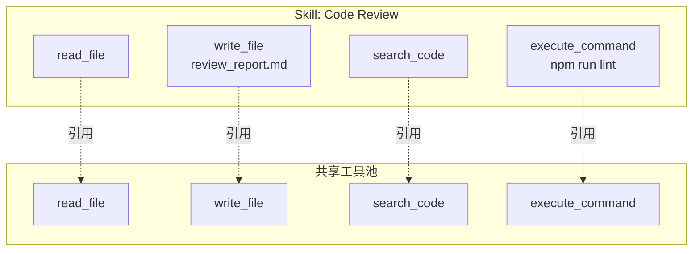
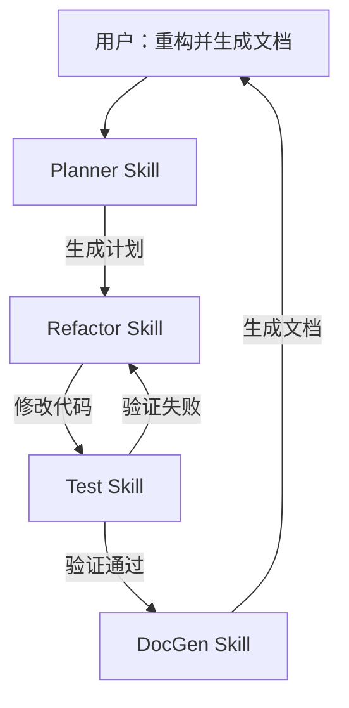

# 16. Skills 与能力编排

## 一、为什么需要 Skills 层

Tool 是原子操作（读文件、执行命令、调用 API），但用户不会说"请执行 read_file 和 write_file"，用户会说"请帮我审查这段代码"或"生成 API 文档"。

**Skill 是 Agent 的高阶能力单元**，它将底层工具、领域知识和执行模式封装成用户可理解和选择的能力：

- **CodeReview Skill**：读取代码 → 静态分析 → 生成审查意见 → 输出报告
- **DocGen Skill**：扫描接口 → 提取注释 → 生成 Markdown 文档 → 写入文件
- **Refactor Skill**：识别坏味道 → 制定重构计划 → 执行修改 → 运行测试验证

没有 Skills 层，Agent 的能力就是一盘散沙的 Tool 列表；LLM 很难在几十上百个工具中选出正确的组合来完成一个高阶任务。

## 二、Skill 的核心结构

一个 Skill 不是简单的 "Tool 集合"，它包含完整的执行上下文：

```
struct Skill:
    id: String                     // 唯一标识，如 "code_review"
    name: String                   // 人类可读名称
    description: String            // 功能描述（用于 LLM 理解何时调用）
    version: String                // 语义化版本

    // 能力组成
    tools: List<ToolDefinition>    // 该 Skill 需要的工具
    knowledge: List<KnowledgeBase> // 领域知识（编码规范、API 文档等）
    workflows: List<Workflow>      // 预定义的执行流程
    prompts: List<PromptTemplate>  // Skill 专用的 Prompt 模板

    // 行为约束
    constraints: List<Constraint>  // 使用该 Skill 时的限制
    requiredContext: List<String>  // 执行前必须收集的上下文
    outputSchema: JsonSchema       // 输出格式约束
```

### 2.1 Skill 与 Tool 的关系



关键区别：

| 维度 | Tool | Skill |
|------|------|-------|
| **粒度** | 原子操作 | 高阶任务 |
| **认知对象** | Runtime / 开发者 | 用户 / LLM |
| **组合性** | 不可再分 | 编排多个 Tool |
| **上下文** | 无 | 携带知识、约束、模板 |
| **生命周期** | 静态注册 | 可动态启用/禁用 |

## 三、Skill Registry

Skill 需要独立的注册表，与 Tool Registry 分离但协作：

```
class SkillRegistry:
    skills: Map<String, Skill>
    activeSkills: Map<String, Skill>     // 当前会话启用的 Skill

    function register(skill: Skill):
        // 校验 Skill 完整性
        validateSkill(skill)
        // 检查工具依赖是否满足
        for tool in skill.tools:
            if not toolRegistry.hasTool(tool.name):
                throw MissingToolError(skill.id, tool.name)
        skills[skill.id] = skill

    function enable(session: Session, skillId: String):
        skill = skills[skillId]
        if skill == null:
            throw SkillNotFoundError(skillId)

        // 将 Skill 的工具注入会话
        for tool in skill.tools:
            session.toolRegistry.register(tool)

        // 将 Skill 的上下文注入 System Prompt
        session.systemPrompt.appendSkillContext(skill)

        activeSkills[session.id + ":" + skillId] = skill
        emitEvent("skill_enabled", { sessionId: session.id, skillId: skillId })

    function disable(session: Session, skillId: String):
        skill = activeSkills.remove(session.id + ":" + skillId)
        if skill != null:
            for tool in skill.tools:
                session.toolRegistry.unregister(tool.name)
            session.systemPrompt.removeSkillContext(skillId)
            emitEvent("skill_disabled", { sessionId: session.id, skillId: skillId })

    function listAvailable(): List<Skill>:
        return skills.values()

    function listActive(session: Session): List<Skill>:
        return activeSkills.values().filter(s -> s.sessionId == session.id)
```

### 3.1 Skill 的发现与加载

```
function discoverSkills(skillPath: String): List<Skill>:
    skills = []
    for dir in listDirectories(skillPath):
        manifest = readJson(dir + "/skill.json")
        skill = Skill {
            id: manifest.id,
            name: manifest.name,
            description: manifest.description,
            tools: loadTools(dir + "/tools"),
            knowledge: loadKnowledge(dir + "/knowledge"),
            workflows: loadWorkflows(dir + "/workflows"),
            prompts: loadPrompts(dir + "/prompts")
        }
        skills.append(skill)
    return skills
```

典型的 Skill 目录结构：

```
skills/
├── code_review/
│   ├── skill.json              # Skill 元数据
│   ├── tools/
│   │   ├── analyze_complexity.json
│   │   └── check_style.json
│   ├── knowledge/
│   │   ├── style_guide.md      # 代码规范
│   │   └── common_issues.md    # 常见问题模式
│   ├── workflows/
│   │   └── review_workflow.yaml
│   └── prompts/
│       ├── system_prompt.txt
│       └── report_template.txt
└── doc_gen/
    ├── skill.json
    └── ...
```

## 四、Skill 的 Prompt 注入

启用 Skill 时，其信息需要以 LLM 可理解的方式注入 System Prompt：

```
function formatSkillForPrompt(skill: Skill): String:
    lines = []
    lines.append("## Skill: " + skill.name)
    lines.append("ID: " + skill.id)
    lines.append("Description: " + skill.description)

    if skill.tools.isNotEmpty():
        lines.append("Available tools for this skill:")
        for tool in skill.tools:
            lines.append("- " + tool.name + ": " + tool.description)

    if skill.constraints.isNotEmpty():
        lines.append("Constraints:")
        for constraint in skill.constraints:
            lines.append("- " + constraint.description)

    if skill.workflows.isNotEmpty():
        lines.append("Typical workflow:")
        for step in skill.workflows[0].steps:
            lines.append((step.index + 1) + ". " + step.description)

    return lines.join("\n")
```

注入后的 System Prompt 片段示例：

```
You are a software engineering assistant.

## Active Skills

### Skill: Code Review
ID: code_review
Description: Analyze code changes for quality, security, and style issues.
Available tools for this skill:
- analyze_complexity: Calculate cyclomatic complexity
- check_style: Verify adherence to style guide
Constraints:
- Do not suggest changes to test files
- Focus on security-critical paths first
Typical workflow:
1. Read the changed files
2. Run static analysis
3. Generate review comments
4. Output summary report
```

## 五、Skill 编排

### 5.1 多 Skill 协作

复杂任务需要多个 Skill 协作完成：



### 5.2 Skill 切换

一个 Turn 内可能需要切换 Skill：

```
function switchSkill(session: Session, newSkillId: String):
    currentSkill = session.activeSkill

    // 保存当前 Skill 的上下文
    if currentSkill != null:
        session.skillContextStore.save(currentSkill.id, session.context)

    // 加载新 Skill
    newSkill = skillRegistry.get(newSkillId)
    skillRegistry.enable(session, newSkillId)
    session.activeSkill = newSkill

    // 恢复新 Skill 的历史上下文（如果有）
    savedContext = session.skillContextStore.load(newSkillId)
    if savedContext != null:
        session.context.merge(savedContext)

    emitEvent("skill_switched", {
        from: currentSkill?.id,
        to: newSkillId
    })
```

### 5.3 Skill 间的上下文隔离

不同 Skill 可能有冲突的上下文需求：

```
struct SkillContext:
    skillId: String
    messages: List<Message>
    toolResults: List<ToolResult>
    metadata: Map<String, Json>

class SkillContextStore:
    contexts: Map<String, SkillContext>

    function save(skillId: String, context: SessionContext):
        contexts[skillId] = SkillContext {
            skillId: skillId,
            messages: context.messages.copy(),
            toolResults: context.toolResults.copy(),
            metadata: context.metadata.copy()
        }

    function load(skillId: String): SkillContext:
        return contexts[skillId]
```

## 六、Skill 版本与兼容性

Skill 会独立演进，需要版本管理：

```
struct SkillVersion:
    major: Integer      // 不兼容变更
    minor: Integer      // 新增能力，向后兼容
    patch: Integer      // Bug 修复

function checkCompatibility(required: SkillVersion, actual: SkillVersion): Boolean:
    if actual.major != required.major:
        return false
    if actual.minor < required.minor:
        return false
    return true

// Agent 声明依赖
agent.manifest.skills = [
    { id: "code_review", version: ">= 2.1.0" },
    { id: "doc_gen", version: ">= 1.0.0" }
]
```

## 七、内置 Skill vs 外部 Skill

| 类型 | 内置 Skill | 外部 Skill |
|------|-----------|-----------|
| **分发** | 随 Runtime 打包 | 通过 MCP / 插件市场安装 |
| **信任** | 高（经过审查） | 需用户显式授权 |
| **更新** | 随 Runtime 版本更新 | 独立版本周期 |
| **示例** | file_operations, git | github_integration, jira |

```
function loadExternalSkill(manifestUrl: String): Skill:
    manifest = fetchJson(manifestUrl)

    // 安全审查
    reviewResult = securityReview(manifest)
    if not reviewResult.passed:
        throw UnsafeSkillError(manifest.id, reviewResult.issues)

    // 用户确认
    if not userConfirm("Install external skill: " + manifest.name + "?"):
        throw InstallationCancelledError()

    return downloadAndRegister(manifest)
```

## 八、最佳实践

1. **Skill 是用户-facing 的概念**：用户选择 "启用代码审查"，而不是 "启用 read_file 和 analyze_complexity"
2. **Skill 描述要清晰**：LLM 根据描述决定是否激活某个 Skill，描述质量直接影响调用准确率
3. **避免 Skill 膨胀**：一个 Skill 聚焦一个领域，不要试图做一个"万能 Skill"
4. **Skill 间解耦**：Skill 应该尽量少依赖其他 Skill 的内部状态
5. **显式启用优于隐式加载**：不要自动启用所有可用 Skill，用户应该明确选择
6. **版本锁定**：生产环境应该锁定 Skill 版本，避免自动更新导致行为变化
7. **Skill 也要有权限**：某些 Skill（如 deploy_production）应该有更严格的权限策略
8. **监控 Skill 使用**：哪些 Skill 被频繁启用、哪些触发失败率高，是产品改进的信号
