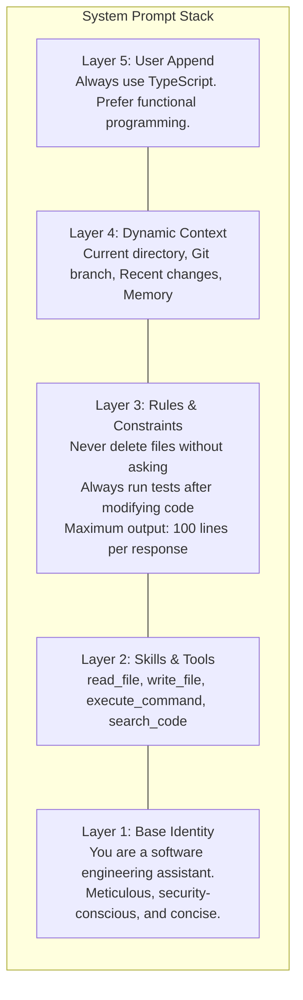
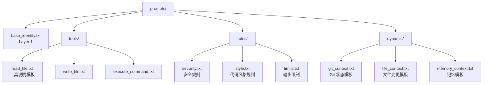

# 05. 提示词管理

## 一、为什么 System Prompt 不能是单一字符串

大多数开发者最初设计 Agent 时，会把 System Prompt 写成一个长字符串：

```
systemPrompt = "You are a helpful coding assistant. You can read files, write files, and execute commands. Always be concise. When you need to modify code, show the diff."
```

这在原型阶段可行，但在生产环境中很快会崩溃：

- **技能扩展困难**：每增加一个新工具，就要修改这个字符串
- **上下文动态变化**：当前工作目录、git 分支、最近修改的文件需要实时注入
- **多 Agent 场景**：不同 Agent 需要不同的身份和能力描述
- **用户自定义**：用户可能想追加自己的规则
- **缓存优化**：某些 Provider 对 System Prompt 的前缀有缓存机制，需要结构化利用

生产级 Agent 的 System Prompt 是**分层动态拼接**的。

## 二、System Prompt 的五层模型



| 层级 | 稳定性 | 来源 | 更新频率 |
|------|--------|------|----------|
| **Layer 1: Base Identity** | 最稳定 | 代码/配置文件 | 几乎不变 |
| **Layer 2: Skills & Tools** | 较稳定 | Tool Registry 快照 | 每次 Agent 切换 |
| **Layer 3: Rules & Constraints** | 中等 | Agent 配置 | 配置变更时 |
| **Layer 4: Dynamic Context** | 最动态 | Hook / 环境扫描 | 每个 Turn |
| **Layer 5: User Append** | 用户可控 | 用户设置 | 随时 |

## 三、分层 Prompt 的组装流程

```
function assembleSystemPrompt(session: Session, agent: Agent): SystemPrompt:
    parts = []

    // Layer 1: Base Identity
    parts.append(agent.baseIdentity)

    // Layer 2: Skills & Tools
    tools = registry.listForLlm()
    parts.append(formatToolsDescription(tools))

    // Layer 3: Rules & Constraints
    parts.append(agent.rules)

    // Layer 4: Dynamic Context（通过 Hook 注入）
    dynamicContext = collectDynamicContext(session)
    parts.append(dynamicContext)

    // Layer 5: User Append
    if session.userPreferences.systemAppend:
        parts.append(session.userPreferences.systemAppend)

    // 触发 Hook，允许修改最终 Prompt
    finalPrompt = SystemPrompt { parts: parts }
    hooks.execute("before_inference", { systemPrompt: finalPrompt })

    return finalPrompt

function collectDynamicContext(session: Session): String:
    context = []

    // 工作区信息
    context.append("Working directory: " + session.workingDirectory)

    // Git 状态
    if session.gitInfo:
        context.append("Git branch: " + session.gitInfo.branch)
        context.append("Git status: " + session.gitInfo.status)

    // 最近修改的文件
    recentChanges = session.fileWatcher.getRecentChanges(5)
    if recentChanges.isNotEmpty():
        context.append("Recently modified files: " + recentChanges.join(", "))

    // 持久化记忆
    if session.memories.isNotEmpty():
        context.append("Relevant memories:")
        for memory in session.memories:
            context.append("- " + memory.content)

    return context.join("\n")
```

## 四、Prompt 的模板化组织

虽然具体语法不重要，但关键是 Prompt 必须**可维护地组织**，而不是散落在代码字符串中。

### 4.1 按文件组织



### 4.2 加载与组合

```
class PromptManager:
    basePath: String
    templates: Map<String, String>

    function loadTemplates():
        for file in listFiles(basePath + "/*.txt"):
            templates[file.name] = readFile(file.path)

    function render(templateName: String, variables: Map): String:
        template = templates[templateName]
        return substituteVariables(template, variables)

    function assemble(agentType: String): SystemPrompt:
        return SystemPrompt {
            header: templates["base_identity"],
            sections: [
                render("tools_" + agentType, { tools: registry.list() }),
                render("rules_security", {}),
                render("rules_style", { language: "typescript" }),
                render("dynamic_git", { gitInfo: session.gitInfo }),
            ]
        }
```

## 五、动态注入机制

Prompt 不是静态的。Runtime 必须支持在运行时修改。

### 5.1 Hook 注入点

```
// 在 before_inference Hook 中修改 System Prompt
class ContextInjectionHook implements AgentHook:
    function beforeInference(context: InferenceContext):
        // 注入最近打开的文件
        recentFiles = workspace.getRecentlyOpenedFiles(3)
        context.systemPrompt.appendSection("Recently opened files:")
        for file in recentFiles:
            context.systemPrompt.appendSection("- " + file.path)

        // 注入错误上下文（如果上一个 Turn 出错了）
        if context.previousTurn?.status == "error":
            context.systemPrompt.appendSection(
                "Note: The previous operation failed with: " + context.previousTurn.errorMessage
            )
```

### 5.2 运行时参数修改

```
// 某些 Agent 需要根据任务复杂度调整参数
function adjustParameters(context: InferenceContext):
    if context.taskComplexity == "high":
        context.parameters.temperature = 0.2    // 更确定性
        context.parameters.maxTokens = 4096     // 更长输出
        context.systemPrompt.appendSection(
            "This is a complex task. Take your time and think step by step."
        )
    else if context.taskComplexity == "low":
        context.parameters.temperature = 0.7    // 更灵活
        context.parameters.maxTokens = 512      // 简短回答
```

## 六、Prompt Caching 优化

某些 LLM Provider（如 Anthropic）支持 System Prompt 的**前缀缓存**：如果 System Prompt 的前 N 个 token 与前一次请求相同，可以大幅降低 Token 成本。

### 6.1 2-Part System Prompt 结构

为了利用缓存，将 System Prompt 分为两部分：

```
struct SystemPrompt:
    header: String       // 稳定部分（Identity + Tools + Rules）
    rest: String         // 动态部分（Context + User Append）

// 示例
systemPrompt = SystemPrompt {
    header: "You are a coding assistant. Available tools: read_file, write_file...",
    rest: "Working directory: /home/user/project. Git branch: main."
}
```

**原理**：`header` 在多次请求中几乎不变，可以被 Provider 缓存；`rest` 每次变化，但不影响缓存命中率。

### 6.2 缓存感知的组装策略

```
function assembleWithCaching(session: Session): SystemPrompt:
    // 检查缓存是否仍有效
    if session.cachedHeader == null || session.toolsHash != registry.hash():
        // 重新构建 header（Tool 列表变了）
        session.cachedHeader = buildHeader(session.agent)
        session.toolsHash = registry.hash()

    header = session.cachedHeader
    rest = buildDynamicContext(session)

    return SystemPrompt { header: header, rest: rest }
```

## 七、User Message 的结构化

除了 System Prompt，User Message 也可以结构化，以传递更多信息：

```
// 普通用户输入
Message {
    role: "user",
    parts: [TextPart { content: "Refactor the auth module" }]
}

// 带附件的用户输入
Message {
    role: "user",
    parts: [
        TextPart { content: "What's wrong with this code?" },
        FilePart { path: "/src/auth.js", content: "..." },
        ImagePart { source: screenshotOfError }
    ]
}

// 引用之前消息的用户输入
Message {
    role: "user",
    parts: [
        TextPart {
            content: "Use the same approach for the login function",
            references: [MessageReference { messageId: "msg_123", partIndex: 0 }]
        }
    ]
}
```

## 八、提示词管理的最佳实践

1. **分层是强制的，不是可选的**：任何生产级 Agent 都必须有分层 Prompt 系统
2. **每层应该是独立可测试的**：可以单独渲染某一层，验证其输出是否符合预期
3. **使用版本控制管理 Prompt**：Prompt 的变更应该像代码变更一样被审查和版本化
4. **监控 Prompt 的 Token 消耗**：每层对 Token 的占用应该可观测，发现异常增长时能定位到哪一层
5. **避免 Prompt 注入**：用户输入不应该直接拼接到 System Prompt 中，必须经过清理或放在 User Message 中
6. **保持 Prompt 的简洁性**：过长的 System Prompt 会降低 LLM 的注意力效率，定期审查并移除无用内容
7. **A/B 测试 Prompt**：支持运行时切换 Prompt 版本，比较不同 Prompt 的效果
